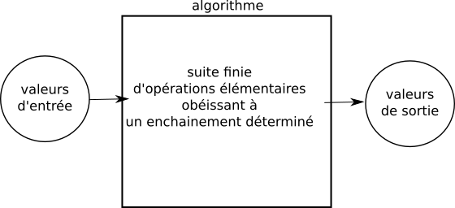
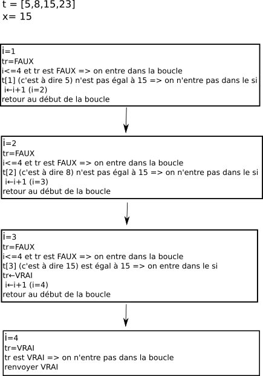

## 1) Qu'est-ce qu'un algorithme

Pour commencer, je vous conseille de visionner la vidéo de David Louapre (chaine YouTube "[Science étonnante](https://www.youtube.com/channel/UCaNlbnghtwlsGF-KzAFThqA)"). Dans cette vidéo, David aborde quasiment toutes les notions qui seront vues ci-dessous (mais il va aussi plus loin...).

[https://www.youtube.com/watch?v=AgtOCNCejQ8](https://www.youtube.com/watch?v=AgtOCNCejQ8)

La notion d'algorithme est souvent associée à l'informatique, pourtant le terme algorithme vient du nom du mathématicien perse du 9e siècle Muhammad Ibn Mūsā al-Khuwārizmī. La notion d'algorithme est donc très antérieure à la création du premier ordinateur.

Mūsā al-Khuwārizmī :


Mais qu'est-ce qu'un algorithme ?

Voici deux définitions trouvées dans la littérature :

- Procédure de calcul bien définie qui prend en entrée une valeur ou un ensemble de valeur, et qui donne en sortie une valeur ou un ensemble de valeur.

- Un algorithme est la spécification d'un schéma de calcul sous forme d'une suite finie d'opérations élémentaires obéissant à un enchainement déterminé.

Le terme "calcul" revient dans les 2 définitions, un algorithme effectue donc des calculs (encore faudrait-il définir précisément ce terme de "calcul", mais cela nous entraînerait trop loin).

Pour concevoir un algorithme, la 2e définition nous précise qu'il est nécessaire de définir "une suite finie d'opérations élémentaires obéissant à un enchainement déterminé". L'ordre dans lequel nous allons définir nos "opérations élémentaires" va donc avoir son importance. Mais, qu'est-ce qu'une "opération élémentaire" ? Ici aussi, définir "opération élémentaire" n'est pas chose aisée ! On peut tout de même dire qu'une "opération élémentaire" est une action simple, qui doit être facilement compréhensible pour la personne chargée d'effectuer cette action. L'action "Peser 100 g de farine" peut être considérée comme une "opération élémentaire", en effet, tout le monde est capable de comprendre ce que cela signifie et la réalisation de cette opération ne prête ni à interprétation, ni à confusion. En revanche "Prendre de la farine, des oeufs, du sucre et du chocolat afin de faire un gâteau au chocolat" n'est clairement pas une "opération élémentaire", car l'action décrite ici manque de précision, c'est une opération complexe (même si dans la pratique il n'est pas très difficile de faire un gâteau au chocolat, ce n'est pas évident pour quelqu'un qui n'a pas l'habitude). La frontière entre "opération élémentaire" et "opération complexe" n'est pas toujours évidente, en effet, l'opération "Peser 100 g de farine" pourrait être encore plus précise : "mettre la balance à zéro (faire la tare), verser ensuite de la farine sur le plateau de la balance jusqu'à ce que le nombre 100 soit affiché sur l'écran de la balance"

À noter que "procédure de calcul bien défini" dans la première définition est équivalent à "suite finie d'opérations élémentaires obéissant à un enchainement déterminé" dans la deuxième définition. Personnellement, je trouve la deuxième définition plus explicite.

On pourrait résumer ce qu'est un algorithme par le schéma suivant :



Prenons un exemple concret :

Nous allons étudier cette année, ainsi que l'année prochaine, des algorithmes de tri pour les tableaux (un tableau ressemble beaucoup à une liste en Python, même si ce n'est pas exactement la même chose). Nous avons en entrée un tableau non trié et nous obtenons en sortie un tableau trié :


La "valeur de sortie" n'est pas obligatoirement du même type que la "valeur d'entrée". Prenons l'exemple d'un algorithme qui prend en entrée un tableau t d'entiers et un entier x, et qui "répond" par "oui" ou par "non" à la question "x est-il présent dans le tableau t ?". Dans ce cas, la "valeur de sortie" sera "oui" ou "non".


## 2) un premier algorithme

Essayons d'écrire l'algorithme décrit ci-dessus :

Nous devons trouver la suite d'opérations élémentaires qui permettra de répondre à la question : "x est-il présent dans le tableau t ?"

```
VARIABLE
t : tableau d'entiers
x : nombre entier
tr : booléen (VRAI ou FAUX)
i : nombre entier
DEBUT
tr ← FAUX
i ← 1
tant que i<=longueur(t) et que tr==FAUX:
  si t[i]==x:
    tr ← VRAI
  fin si
  i ← i+1
fin tant que
renvoyer la valeur de tr
FIN
```

Remarques :

- Quand on écrit un algorithme, on utilise un langage dit "langage naturel" ("tant que", "si"...), ce langage naturel permet de passer facilement à un langage de programmation (Python, Java...), on dit alors que l'on implémente l'algorithme.

- Traditionnellement (sauf erreur de ma part, ce n'est pas une obligation), lorsque l'on écrit un algorithme le premier élément d'un tableau a pour indice 1 (alors que dans la plupart des langages de programmation le premier élément d'un tableau a pour indice 0). Il faut donc faire attention à cela lorsque l'on veut implémenter un algorithme.

- Dans l'algorithme ci-dessus, on part du principe qu'il existe une fonction "longueur" qui prend en paramètre un tableau et qui renvoie le nombre d'éléments présents dans ce tableau. Vous noterez que déterminer le nombre d'éléments présents dans un tableau n'est pas vraiment une "opération élémentaire", pourtant ici, on considère l'utilisation de "longueur" comme une opération élémentaire ! Il arrive relativement souvent que l'on s'autorise ce genre de liberté quand on écrit un algorithme.

## 3) Étudier un algorithme

La première chose à faire quand on étudie un algorithme, c'est de le "faire tourner à la main" : on "exécute" l'algorithme en utilisant uniquement une feuille et un crayon. Voilà ce que cela pourrait donner avec l'algorithme que nous venons d'écrire :



## 4) complexité d'un algorithme

La notion de complexité d'un algorithme va rendre compte de l'efficacité de cet algorithme. Pour un même problème, par exemple trier un tableau, il existe plusieurs algorithmes, certains algorithmes sont plus efficaces que d'autres (par exemple un algorithme A mettra moins de temps qu'un algorithme B pour résoudre exactement le même problème, sur la même machine).

Il existe 2 types de complexité : une complexité en temps et une complexité en mémoire. Nous nous intéresserons ici uniquement à la complexité en temps. La complexité en temps est directement liée au nombre d'opérations élémentaires qui doivent être exécutées afin de résoudre un problème donné. L'évaluation de ce nombre d'opérations élémentaires n'est pas chose facile, on rencontre souvent des cas litigieux. Prenons tout de suite un exemple avec notre algorithme "x est-il présent dans le tableau t ?".

Il y a 2 cas à traiter :

- L'entier recherché est bien présent dans le tableau, il se trouve à la position d'index j

- L'entier recherché n'est pas présent dans le tableau
Commençons par le premier cas :

```
VARIABLE
t : tableau d'entiers
x : nombre entier
tr : booléen (VRAI ou FAUX)
i : nombre entier
DEBUT
1 fois   tr ← FAUX
1 fois   i ← 1
j+1 fois tant que i<=longueur(t) et que tr==FAUX:
j fois      si t[i]==x:
1 fois       tr ← VRAI
           fin si
j fois     i ← i+1
        fin tant que
1 fois  renvoyer la valeur de tr
FIN
```

Au total nous avons : 1 + 1 + j + 1 + j + 1 + j + 1 = 3j + 5 opérations élémentaires

Dans le cas où l'entier recherché ne se trouve pas dans le tableau (et que le nombre d'éléments dans le tableau est n) :

```
VARIABLE
t : tableau d'entiers
x : nombre entier
tr : booléen (VRAI ou FAUX)
i : nombre entier
DEBUT
1 fois   tr ← FAUX
1 fois   i ← 1
n+1 fois tant que i<=longueur(t) et que tr==FAUX:
n fois      si t[i]==x:
0 fois       tr ← VRAI
           fin si
n fois     i ← i+1
        fin tant que
1 fois  renvoyer la valeur de tr
FIN
```

Au total nous avons : 1 + 1 + n + 1 + n + 0 + n + 1 = 3n + 4 opérations élémentaires

Comme dans la plupart des cas n > j, on effectue plus d'opérations élémentaires quand le nombre recherché n'est pas dans le tableau (sauf dans le cas précis où l'entier recherché est en dernière position, mais nous ne tiendrons pas compte de ce cas). On parle de "complexité dans le pire des cas" quand on s'intéresse uniquement au cas où le nombre d'opérations élémentaires est le plus grand. Dans la suite nous nous intéresserons uniquement à cette complexité dans le pire des cas (dans la suite "complexité" = "complexité en temps dans le pire des cas"). Pour notre exemple, nous considérerons uniquement le cas où le nombre total d'opérations élémentaires est de 3n + 4.

Nous venons de voir que la complexité dépend de la taille du tableau, plus le tableau est grand et plus le nombre d'opérations élémentaires à effectuer est important. Pour effectuer des comparaisons entre plusieurs algorithmes, nous allons raisonner sur des tableaux de grande taille, car plus les tableaux sont grands et plus les différences entre les algorithmes seront flagrantes. Pour comparer des algorithmes, nous allons donc uniquement nous intéresser à ce que l'on appelle "l'ordre de grandeur asymptotique". La définition précise de cet "ordre de grandeur asymptotique" est trop complexe pour être abordé ici. Vous devez juste savoir que cet "ordre de grandeur asymptotique" concerne les cas où l'on prend n très très grand. On note cet "ordre de grandeur asymptotique" avec un O majuscule. Pour le cas qui nous intéresse, nous aurons :

3n+4 = O(n)

La relation ci-dessus signifie que "3n+4 est dominée asymptotiquement par n", autrement dit "si n est suffisamment grand, il existe une constante c qui permettra d'avoir c.n ⩾ 3n+4", vous n'avez pas tout compris ? Cela n'a pas vraiment d'importance, ce qu'il faut retenir c'est que nous utiliserons systématiquement cette notation O pour exprimer la complexité des algorithmes : au final on dira donc que la complexité de notre algorithme "x est-il présent dans le tableau t ?" est O(n).

Comment obtient-on cette notation O à partir du nombre d'opérations élémentaires ?

Ici nous avons simplement supprimé la constante (4) et le coefficient devant le n (c'est-à-dire 3), il reste donc uniquement n d'où le 3n+4 = O(n). Dans le cas où nous avons un polynôme de degrés quelconque, par exemple pour 6n<sup>2</sup>+3n+10, il suffit de :

- supprimer la constante

- garder uniquement le n qui possède l'exposant le plus grand

- supprimer le coefficient devant le n

On aura donc 6n<sup>2</sup>+3n+10 = O(n<sup>2</sup>) : "6n<sup>2</sup>+3n+10 est dominée asymptotiquement par n<sup>2</sup>"