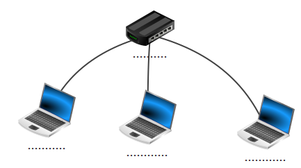

### activité 16.1

Complétez le schéma ci-dessous avec les termes suivants : 

ordinateur 1, ordinateur 2, switch, ordinateur 3

### activité 16.2

Déterminez les adresses réseaux à partir des adresses IP suivantes :

147.12.1.24/16
192.168.2.45/24
5.23.65.87/8

### activité 16.3

Soit 2 machines A et B connectées à un switch, dites dans quels cas ces 2 machines pourront communiquer ensemble :

- adresse IP de A : 172.23.4.7/16 ; adresse IP de B : 172.23.5.8/16

- adresse IP de A : 24.2.8.127/8 ; adresse IP de B : 24.23.5.52/8

- adresse IP de A : 193.28.7.2/24 ; adresse IP de B : 193.28.8.3/24

### activité 16.4

Combien de machines peut-on trouver au maximum :

- dans un réseau d'adresse réseau 192.168.2.0/24 ?

- dans un réseau d'adresse réseau 176.24.0.0/16 ?

- dans un réseau d'adresse réseau 10.0.0.0/8 ?