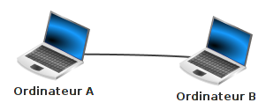

## 1) introduction

Il est possible de faire communiquer deux ordinateurs en les reliant par un simple câble. On dit alors que ces deux ordinateurs sont en réseau.

2 ordinateurs en réseau :

Dans la plupart des cas, le câble reliant les 2 ordinateurs est un câble Ethernet. Ce type de câble possède à ses 2 extrémités des prises RJ45 (il existe d'autres types de câbles qui permettent de mettre 2 ordinateurs en réseau, mais l'utilisation de câbles Ethernet est tellement majoritaire que nous ne nous intéresserons pas aux autres types de câbles).

câble Ethernet avec prises RJ45 :

Un ordinateur relié à un réseau doit posséder une carte réseau, on identifie cette carte réseau de type Ethernet grâce à la prise RJ45 femelle située souvent à l'arrière de l'ordinateur.

carte réseau de type Ethernet :

Relier 2 ordinateurs peut avoir un intérêt, mais dans la plupart des cas, un réseau sera constitué d'un plus grand nombre d'ordinateurs. Dans ce cas, il est nécessaire d'utiliser un commutateur réseau, souvent appelé switch (même en français). Un switch est constitué de plusieurs prises RJ45.

plusieurs switchs :

Comme nous le montre la photo ci-dessus, il existe des switchs de différentes tailles, certains switchs possèdent 8 prises RJ45 alors que d'autres peuvent en posséder 24.

Chaque ordinateur doit être relié au switch par l'intermédiaire d'un câble Ethernet.

réseau de 4 ordinateurs :

Dans l'exemple du schéma ci-dessus, les ordinateurs A, B, C et D sont en réseau, chaque ordinateur peut communiquer avec les 3 autres.

Les switchs ayant un nombre de prises RJ45 limité, il peut être nécessaire d'utiliser plusieurs switchs dans un même réseau.

réseau de 5 ordinateurs :

Dans l'exemple du schéma ci-dessus, les ordinateurs A, B, C, D et E sont en réseau. A, B et C sont reliés à un switch, D et E sont reliés à un autre switch. Les 2 switchs étant reliés ensemble.

Depuis le début nous avons uniquement parlé de réseaux filaires (les différents composants du réseau sont reliés par des câbles), il est aussi possible de mettre plusieurs machines en réseau grâce à des technologies sans fil (utilisation des ondes radio pour transmettre l'information entre les différents composants du réseau), par exemple, le wifi (il existe d'autres technologies sans fil que le wifi, mais elles ne seront abordées ici). Chaque ordinateur appartenant au réseau sans fil devra posséder une carte réseau wifi (aujourd'hui tous les ordinateurs portables vendus sont par défaut équipés d'une telle carte). Il sera nécessaire d'utiliser un concentrateur wifi (équivalent du switch en filaire) si l'on désire mettre en réseau plus de deux ordinateurs.

## 2) les adresses IP
### a) introduction

Maintenant que nos ordinateurs sont reliés par l'intermédiaire d'un switch (ou d'un concentrateur wifi), imaginons que l'ordinateur A "souhaite" entrer en communication avec l'ordinateur C. Quand vous désirez communiquer avec quelqu'un par voie postale, il est nécessaire d'écrire l'adresse de cette personne sur une enveloppe, à chaque habitation correspond donc une adresse postale. Et bien, c'est un peu la même chose pour les ordinateurs en réseau, chaque machine possède une adresse. Pendant très longtemps, différentes technologies de réseau, et donc différents types d'adresse, ont coexisté. Aujourd'hui, on trouve presque exclusivement qu'un seul type d'adresse : les adresses IP.

Les adresses IP sont de la forme : "a.b.c.d", avec a, b, c et d compris entre 0 et 255 (a, b, c et d sont codés sur 1 octet). Voici un exemple d'adresse IP : 192.168.0.1

Une partie de l’adresse IP permet d’identifier le réseau auquel appartient la machine et l’autre partie de l’adresse IP permet d’identifier la machine sur ce réseau.

Exemple : Soit un ordinateur A ayant pour adresse IP 192.168.2.1 Dans cette adresse IP "192.168.2" permet d’identifier le réseau (on dit que la machine A appartient au réseau ayant pour adresse réseau 192.168.2.0, pour trouver l'adresse réseau, il suffit de remplacer la partie "machine" de cette adresse IP par un ou des 0) et "1" permet d’identifier la machine sur le réseau.

Toutes les machines appartenant au même réseau devront posséder la même adresse réseau (sinon elles ne pourront pas communiquer, même si elles sont bien physiquement reliées).

Prenons 2 exemples, soit 2 machines A et B en réseau :

- la machine A a pour adresse IP 192.168.2.5 et la machine B a pour adresse IP 192.168.2.8. Les 3 premiers octets sont bien identiques ("192.168.2"), A et B ont donc la même adresse réseau "192.168.2.0". Ces 2 machines pourront donc communiquer

- la machine A a pour adresse IP 192.168.2.5 et la machine B a pour adresse IP 192.168.3.8. Les 3 premiers octets ne sont pas identiques ("192.168.2" pour A et "192.168.3" pour B), A et B n'ont pas la même adresse réseau ("192.168.2.0" pour A et "192.168.3.0" pour B). Ces 2 machines ne pourront donc pas communiquer

**Attention**, les adresses IP (a.b.c.d) n’ont forcément pas les parties a, b et c consacrées à l’identification du réseau et la partie d consacrées à l’identification des machines sur le réseau. Entrons un peu dans les détails

### b) les masques de sous-réseaux

#### i) Principes

À chaque adresse IP on associe un masque de sous-réseau. Un masque de sous-réseau est, comme les adresses IP, composé de 4 nombres a.b.c.d. Comme pour les adresses IP, chaque nombre est compris entre 0 et 255 (chaque nombre est codé sur un octet). Voici un exemple de masque de sous-réseau : 255.255.255.0. Pour obtenir une adresse réseau à partir de l'adresse IP d'une machine, il est nécessaire de connaitre le masque de sous-réseau associé à cette adresse IP.

Pour aller plus loin, il va être nécessaire de travailler sur les représentations binaires des adresses IP et des masques de sous-réseau, prenons tout de suite un exemple :

soit l'adresse IP suivante : 192.168.2.1 et le masque de sous-réseau suivant : 255.255.255.0. Ce qui nous donne en binaire 11000000.10101000.00000010.00000001 pour l'adresse IP et 11111111.11111111.11111111.00000000 pour le masque de sous-réseaux (si nécessaire, n'hésitez pas à consulter le chapitre consacré à la conversion base 10 - base 2).

Pour déterminer l'adresse réseau correspondant à l'adresse IP 192.168.2.1, il suffit de faire un "et logique bit à bit" entre l'adresse IP (en binaire) et le masque de sous-réseau (en binaire) : pour chaque bit, si le bit de l'adresse IP est 1 et si le bit du masque de sous-réseau est 1 alors le bit correspondant de l'adresse réseau sera 1. Dans tous les autres cas, le bit du résultat sera à 0 :

Comme vous pouvez le constater, une adresse IP 11000000.10101000.00000010.00000001 associée à une masque de sous-réseau 11111111.11111111.11111111.00000000 donne une adresse réseau 11000000.10101000.00000010.00000000. Ce qui traduit en base 10 donne : une adresse IP 192.168.2.1 associée à un masque de sous-réseau 255.255.255.0 donne une adresse réseau 192.168.2.0 (exactement le résultat déjà obtenu ci-dessus dans le 2a).

Envisageons un autre cas : adresse IP 172.16.28.44 avec un masque de sous-réseau 255.255.0.0. Ce qui nous donne en binaire : adresse IP 10101100.00010000.00011100.00101100 avec un masque de sous-réseau 11111111.11111111.000000000.00000000. En appliquant un "et logique bit à bit", nous obtenons l'adresse réseau suivante : 10101100.00010000.00000000.00000000, soit en base 10 : 172.16.0.0

Un dernier cas : adresse IP 10.5.23.247 avec un masque de sous-réseau 255.0.0.0. Ce qui nous donne en binaire : adresse IP 00001010.00000101.00010111.11110111 avec un masque de sous-réseau 11111111.00000000.00000000.00000000. En appliquant un "et logique bit à bit", nous obtenons l'adresse réseau suivante : 00001010.00000000.00000000.00000000, soit en base 10 : 10.0.0.0

Nous pouvons résumer les 3 exemples ci-dessus comme suit :

- quand le masque de sous-réseau est 255.255.255.0 pour une adresse IP a.b.c.d, les parties a, b et c sont consacrées à l’identification du réseau et la partie d est consacrée à l’identification des machines sur le réseau (l'adresse réseau sera a.b.c.0)
- quand le masque de sous-réseau est 255.255.0.0 pour une adresse IP a.b.c.d, les parties a, b sont consacrées à l’identification du réseau et les parties c et d sont consacrées à l’identification des machines sur le réseau (l'adresse réseau sera a.b.0.0)
- quand le masque de sous-réseau est 255.0.0.0 pour une adresse IP a.b.c.d, la partie a est consacrée à l’identification du réseau et les parties b, c et d sont consacrées à l’identification des machines sur le réseau (l'adresse réseau sera a.0.0.0)

#### ii) Notation CIDR

Il peut être parfois un peu long d'écrire les masques de sous-réseau sous forme de 4 octets (même en base 10). La notation CIDR (Classless Inter-Domain Routing) permet de raccourcir cette notation :

- au lieu d'écrire adresse IP 192.168.2.1 associée à un masque de sous-réseau 255.255.255.0, on pourra directement écrire adresse IP 192.168.2.1/24
- au lieu d'écrire adresse IP 172.16.28.44 associée à un masque de sous-réseau 255.255.0.0, on pourra directement écrire adresse IP 172.16.28.44/16
- au lieu d'écrire adresse IP 10.5.23.247 associée à un masque de sous-réseau 255.0.0.0, on pourra directement écrire adresse IP 10.5.23.247/8

Comme vous l'avez sans doute déjà remarqué, le nombre situé après le / correspond au nombre de bits à 1 dans le masque de sous-réseau :

- pour le masque de sous-réseau 255.255.255.0 qui correspond à 11111111.11111111.11111111.00000000 en binaire, on a 24 bits à 1, d'où le /24
- pour le masque de sous-réseau 255.255.0.0 qui correspond à 11111111.11111111.00000000.00000000 en binaire, on a 16 bits à 1, d'où le /16
- pour le masque de sous-réseau 255.0.0.0 qui correspond à 11111111.00000000.00000000.00000000 en binaire, on a 8 bits à 1, d'où le /8

#### iii) Des cas plus complexes

Dans la plupart des cas, vous rencontrerez des cas "simples" avec des /8, /16 ou /24, mais vous devez aussi savoir que dans certaines situations il est possible de rencontrer des cas plus complexes.

Il est, par exemple, possible de voir des /18 ! Comment faire dans ce cas ?

Imaginons l'adresse IP 172.24.82.47/18 quelle est l'adresse réseau ?

Nous devons obligatoirement travailler en binaire :

- adresse IP 172.24.82.47 en binaire : 10101100.00011000.01010010.00101111
- masque de sous-réseau /18 : 11111111.11111111.11000000.00000000 (on a bien 18 bits à 1) ce qui donne en base 10 : 255.255.192.0

Le "et logique bit à bit" donne : 

D'où une adresse réseau : 10101100.00011000.01000000.00000000 soit en base 10 : 172.24.64.0

Dans le cas d'un masque sous réseau 255.255.192.0 (/18), les 18 bits les plus à gauche permettront d'identifier le réseau, le reste (32-18 = 14 bits) permettra d'identifier la machine. Ici, impossible de raisonner sur les octets (comme en /8, /16 ou /24), pas le choix, il faut raisonner sur les bits.

### c) L'adresse de broadcast

Il existe une adresse IP un peu particulière dans un réseau puisque cette adresse IP permet de contacter toutes les machines du réseau en même temps : c'est l'adresse de broadcast.

Obtenir une adresse de broadcast est relativement simple : il suffit de mettre tous les bits de la partie machine à 1.

Commençons par des exemples simples :

- 192.168.22.33/24 ; la partie machine correspond au dernier octet (puisque 32-24 = 8 bits = 1 octet), pour obtenir l'adresse de broadcast, il suffit donc de mettre tous les bits du dernier octet à 1 : 192.168.22.255
- 172.43.28.12/16 ; la partie machine correspond aux 2 derniers octets (puisque 32-16 = 16 bits = 2 octets), pour obtenir l'adresse de broadcast, il suffit donc de mettre tous les bits des deux derniers octets à 1 : 172.43.255.255
- 19.68.221.23/8 ; la partie machine correspond aux derniers octets (puisque 32-8 = 24 bits = 3 octets), pour obtenir l'adresse de broadcast, il suffit donc de mettre tous les bits des trois derniers octets à 1 : 19.255.255.255

Évidemment, la situation se complique un peu avec un masque de sous-réseau un peu plus exotique :

Prenons un exemple avec le masque 255.255.255.240 qui donne en binaire 11111111.11111111.11111111.11110000, soit un /28 (28 bits à 1) et l'adresse IP 195.32.12.22/28. Quelle est dans ce cas l'adresse de broadcast (et pendant que nous y sommes, nous rechercherons aussi l'adresse réseau) ?

L'adresse IP donne en binaire : 11000011.00100000.00001100.00010110, dans cette adresse, seuls les 4 bits les plus à droite sont consacrés à la partie machine de l'adresse IP. 

Pour avoir l'adresse de broadcast, il faut mettre à 1 les 4 bits les plus à droite : 11000011.00100000.00001100.0001**1111**, soit en décimal : 195.32.12.31. L'adresse de broadcast est donc de 195.32.12.31

Pour avoir l'adresse réseau, il faut mettre à 0 les 4 bits les plus à droite : 11000011.00100000.00001100.0001**0000**, soit en décimal : 195.32.12.16. L'adresse de réseau est donc de 195.32.12.16

Conclusion : Si une machine M1 d'adresse IP 195.32.12.22/28 appartient à un réseau R1, le réseau R1 a une adresse réseau 195.32.12.16 et une adresse de broadcast 195.32.12.31

## 3) Nombre de machines adressables dans un réseau

Selon le masque de sous-réseau, le nombre de machines qui peuvent appartenir à un réseau varie grandement :

Avec un masque 255.255.255.0, nous avons à notre disposition un octet pour la partie machine. Avec un octet, il est possible de coder 256 valeurs (28 = 256). Mais, il ne faut pas oublier que l'adresse réseau (tous les bits de la partie machine à 0) ne peut pas être utilisée par une machine. De la même façon, l'adresse de broadcast (tous les bits de la partie machine à 1) ne peut pas non plus être utilisé par une machine. En conclusion, dans le cas où nous utilisons un masque 255.255.255.0 nous pouvons adresser 256 - 2 = 254 machines

Avec un masque de 255.255.0.0, nous avons 2 octets (16 bits) à consacrer à la partie machine. Avec 2 octets, il est possible de coder 216 = 65536 valeurs. Nous devons ensuite enlever l'adresse réseau et l'adresse de broadcast, d'où 65536 - 2 = 65534 machines

Avec un masque de 255.0.0.0, nous avons 3 octets (24 bits) à consacrer à la partie machine. Avec 3 octets, il est possible de coder 224 = 16777216 valeurs. Nous devons ensuite enlever l'adresse réseau et l'adresse de broadcast, d'où 16777216 - 2 = 16777214 machines

Un dernier exemple avec un masque de sous-réseau un peu "exotique" : reprenons notre exemple avec le masque 255.255.255.240. En convertissant ce masque en binaire (11111111.11111111.11111111.11110000), nous pouvons constater qu'il y a uniquement 4 bits réservés à la machine. Avec 4 bits, il est possible de coder 24 = 16 valeurs. Il nous faut ensuite retrancher l'adresse réseau (195.32.12.16) et l'adresse de broadcast (195.32.12.31), d'où 16 - 2 = 14 machines. Comme dans ce cas il n'y a pas trop d'adresses possibles, nous pouvons toutes les énumérer : 195.32.12.17, 195.32.12.18, 195.32.12.19, 195.32.12.20, 195.32.12.21, 195.32.12.22, 195.32.12.23, 195.32.12.24, 195.32.12.25, 195.32.12.26, 195.32.12.27, 195.32.12.28, 195.32.12.29, 195.32.12.30, comme vous pouvez le constater, nous avons bien 14 adresses IP.

## 4) Les adresses IPv6 

Les adresses IP que nous avons étudiées ci-dessus sont appelées *adresse IPv4* (adresse IP version 4). Une nouvelle norme est en train de remplacer progressivement les adresses IPv4 : les adresses IPv6 (adresse IP version 6). Nous n'étudierons pas cette nouvelle norme ici, mais voici tout de même un exemple d'adresse IPv6 : *2001:0db8:0000:85a3:0000:0000:ac1f:8001*  

