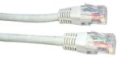

## 1) introduction

Il est possible de faire communiquer deux ordinateurs en les reliant par un simple câble. On dit alors que ces deux ordinateurs sont en réseau.

2 ordinateurs en réseau :

Dans la plupart des cas, le câble reliant les 2 ordinateurs est un câble Ethernet. Ce type de câble possède à ses 2 extrémités des prises RJ45 (il existe d'autres types de câbles qui permettent de mettre 2 ordinateurs en réseau, mais l'utilisation de câbles Ethernet est tellement majoritaire que nous ne nous intéresserons pas aux autres types de câbles).

câble Ethernet avec prises RJ45 :

Un ordinateur relié à un réseau doit posséder une carte réseau, on identifie cette carte réseau de type Ethernet grâce à la prise RJ45 femelle située souvent à l'arrière de l'ordinateur.

carte réseau de type Ethernet :

Relier 2 ordinateurs peut avoir un intérêt, mais dans la plupart des cas, un réseau sera constitué d'un plus grand nombre d'ordinateurs. Dans ce cas, il est nécessaire d'utiliser un commutateur réseau, souvent appelé switch (même en français). Un switch est constitué de plusieurs prises RJ45.

plusieurs switchs :

Comme nous le montre la photo ci-dessus, il existe des switchs de différentes tailles, certains switchs possèdent 8 prises RJ45 alors que d'autres peuvent en posséder 24.

Chaque ordinateur doit être relié au switch par l'intermédiaire d'un câble Ethernet.

réseau de 4 ordinateurs :

Dans l'exemple du schéma ci-dessus, les ordinateurs A, B, C et D sont en réseau, chaque ordinateur peut communiquer avec les 3 autres.

Les switchs ayant un nombre de prises RJ45 limité, il peut être nécessaire d'utiliser plusieurs switchs dans un même réseau.

réseau de 5 ordinateurs :

Dans l'exemple du schéma ci-dessus, les ordinateurs A, B, C, D et E sont en réseau. A, B et C sont reliés à un switch, D et E sont reliés à un autre switch. Les 2 switchs étant reliés ensemble.

Depuis le début nous avons uniquement parlé de réseaux filaires (les différents composants du réseau sont reliés par des câbles), il est aussi possible de mettre plusieurs machines en réseau grâce à des technologies sans fil (utilisation des ondes radio pour transmettre l'information entre les différents composants du réseau), par exemple, le wifi (il existe d'autres technologies sans fil que le wifi, mais elles ne seront abordées ici). Chaque ordinateur appartenant au réseau sans fil devra posséder une carte réseau wifi (aujourd'hui tous les ordinateurs portables vendus sont par défaut équipés d'une telle carte). Il sera nécessaire d'utiliser un concentrateur wifi (équivalent du switch en filaire) si l'on désire mettre en réseau plus de deux ordinateurs.

## 2) les adresses IP

Maintenant que nos ordinateurs sont reliés par l'intermédiaire d'un switch (ou d'un concentrateur wifi), imaginons que l'ordinateur A "souhaite" entrer en communication avec l'ordinateur C. Quand vous désirez communiquer avec quelqu'un par voie postale, il est nécessaire d'écrire l'adresse de cette personne sur une enveloppe, à chaque habitation correspond donc une adresse postale. Et bien c'est un peu la même chose pour les ordinateurs en réseau, chaque machine possède une adresse. Pendant très longtemps il a existé différentes technologies de réseau et donc différents types d'adresse. Aujourd'hui, on trouve presque exclusivement qu'un seul type d'adresse : les adresses IP (nous étudierons donc uniquement ce type d'adresse).

Les adresses IP sont de la forme : "a.b.c.d", avec a, b, c et d compris entre 0 et 255 (a, b, c et d sont codés sur 1 octet). Voici un exemple d'adresse IP : 192.168.0.1

Une partie de l’adresse IP permet d’identifier le réseau auquel appartient la machine et l’autre partie de l’adresse IP permet d’identifier la machine sur ce réseau.

Exemple : Soit un ordinateur A ayant pour adresse IP 192.168.2.1 Dans cette adresse IP "192.168.2" permet d’identifier le réseau (on dit que la machine A appartient au réseau ayant pour adresse 192.168.2.0, pour trouver l'adresse réseau il suffit de remplacer la partie "machine" de cette adresse IP par un ou des 0) et "1" permet d’identifier la machine sur le réseau.

Toutes les machines appartenant au même réseau devront posséder la même adresse réseau (sinon elles ne pourront pas communiquer ensemble, même si elles sont bien physiquement reliées).

Prenons 2 exemples, soit 2 machines A et B en réseau :

- la machine A a pour adresse IP 192.168.2.5 et la machine B a pour adresse IP 192.168.2.8. Les 3 premiers octets sont bien identiques ("192.168.2"), A et B ont donc la même adresse réseau "192.168.2.0". Ces 2 machines pourront donc communiquer ensemble

- la machine A a pour adresse IP 192.168.2.5 et la machine B a pour adresse IP 192.168.3.8. Les 3 premiers octets ne sont pas identiques ("192.168.2" pour A et "192.168.3" pour B), A et B n'ont pas la même adresse réseau ("192.168.2.0" pour A et "192.168.3.0" pour B). Ces 2 machines ne pourront donc pas communiquer ensemble

**Attention**, les adresses IP (a.b.c.d) n’ont forcément pas les parties a, b et c consacrées à l’identification du réseau et la partie d consacrées à l’identification des machines sur le réseau : on rajoute souvent à l'adresse IP un "/" suivit du nombre 8, 16 ou 24

- si ce nombre est 8 (exemple : 192.168.2.1/8), cela signifie que pour une adresse a.b.c.d/8, la partie a est consacrée à l'adresse réseau, le reste (b, c, d) est consacré à la partie machine de l'adresse IP. On aura donc une adresse réseau de la forme a.0.0.0

- si ce nombre est 16 (exemple : 192.168.2.1/16), cela signifie que pour une adresse a.b.c.d/16, les parties a et b sont consacrées à l'adresse réseau, le reste (c, d) est consacré à la partie machine de l'adresse IP. On aura donc une adresse réseau de la forme a.b.0.0

- si ce nombre est 24 (exemple : 192.168.2.1/24), cela signifie que pour une adresse a.b.c.d/24, les parties a, b et c sont consacrées à l'adresse réseau, le reste (d) est consacré à la partie machine de l'adresse IP. On aura donc une adresse réseau de la forme a.b.c.0

Vous avez sans doute déjà compris que le 8 signifie que les 8 premiers bits (le premier octet) sont consacrés à la partie réseau => a, que le 16 signifie que les 16 premiers bits (les deux premiers octets) sont consacrés à la partie réseau => a.b et que le 24 signifie que les 24 premiers bits (les 3 premiers octets) sont consacrés à la partie réseau => a.b.c

En fait, il est possible d'avoir autre chose que /8, /16 ou /24 (on peut par exemple trouver /10 ou /17...), mais ces cas font intervenir la notion de masque de sous-réseau qui n'est pas au programme de NSI.

Il est à noter que certaines adresses IP ne sont pas disponibles :

une adresse réseau ne peut pas être attribuée à une machine, par exemple aucune machine ne pourra avoir l'adresse IP 192.168.1.0/24 ou encore l'adresse IP 25.0.0.0/8
les adresses IP qui ont tous les octets de la partie "machines" de l'adresse IP à 255 ne sont pas utilisables (ce sont des adresses de broadcast qui permettent d'envoyer des données vers toutes les machines d'un réseau), exemples : 192.167.24.255/24, 172.28.255.255/16 ou encore 4.255.255.255/8 sont des adresses de broadcast

Les adresses IP que nous avons étudiées ci-dessus sont appelées *adresse IPv4* (adresse IP version  4). Une nouvelle norme est en train de remplacer progressivement les adresses IPv4 : les adresses IPv6 (adresse IP  version 6). Nous n'étudierons pas cette nouvelle norme ici, mais voici tout de même un exemple d'adresse IPv6 : *2001:0db8:0000:85a3:0000:0000:ac1f:8001*  

