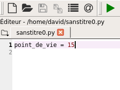

### activité 1.1

Pour écrire nos programmes en Python, nous utiliserons le logiciel Spyder.

Une fois Spyder lancé (attention de bien choisir Spyder3 ou supérieur et surtout pas Spyder2.7), vous devriez obtenir quelque chose qui ressemble à cela :


Spyder se divise en plusieurs fenêtres, deux fenêtres vont principalement nous intéresser : la fenêtre "éditeur" et la fenêtre "console".

Dans la fenêtre "éditeur", saisissez le programme suivante :

```
print("hello world !")
```

Cliquez sur le "triangle vert" afin d'exécuter le programme qui vient d'être saisi.


Spyder va vous demander d'enregistrer le programme, enregistrez-le dans un dossier qui vous servira de dossier de travail

Vous devez voir le message "hello world !" apparaître dans la console


### activité 1.2

Dans la partie "éditeur" de Spyder, saisissez le code suivant :

```
point_de_vie = 15
```



Après avoir exécuté le programme en cliquant sur le triangle vert, il est possible de connaitre la valeur de la variable *point_de_vie*  en tapant le nom de la variable dans la "console" de Spyder.

Tapez *point_de_vie* dans la partie console


Après avoir appuyé sur la touche "Entrée", vous devriez voir la valeur associée au nom point_de_vie s'afficher dans la console.


N.B. : Dans la suite la procédure sera toujours la même :

- Vous utiliserez la partie "éditeur" pour saisir votre programme
- vous utiliserez la partie "console" pour afficher la valeur d'une variable

### activité 1.3

Si vous n'avez pas la possibilité d'utiliser Spyder (ou tout autres éditeurs), vous pouvez utiliser l'outil en ligne basthon à l'adresse [https://basthon.fr/](https://basthon.fr/)

Voici la page d’accueil de basthon :


Une fois sur cette page d'accueil, cliquez sur *Console*, vous devriez alors avoir ceci :


Vous allez retrouvez ce que nous avons déjà vu avec Spyder : à gauche vous avez l'éditeur et à droite la console.

Dans la partie "éditeur" de Basthon, saisissez le code suivant :

```
point_de_vie = 15
```
Cliquez ensuite sur le bouton *Exécuter*

Vous pouvez ici aussi utiliser la console pour connaître la valeur d'une variable :

Tapez *point_de_vie* dans la partie console de Basthon et appuyez sur "Entrée"


### activité 1.4

Testez le programme suivant :

```python
a = 5.2
b = 12
```

après  avoir exécuté ce programme, tapez type(a) puis type(b) dans la console.

Vérifiez que le type de la variable *a* est float et le type de la variable *b* est *int*

### activité 1.5

Quelles sont les valeurs des variables suivantes : d, e, f, g, h et i après l'exécution du programme ci-dessous

```python
import math
a = 5
b = 16
c = 3.14 / 2
d = b / a
e = b // a
f = b % a
g = math.pow(a,2)
h = math.sqrt(b)
i = math.sin(c)
```
Vérifiez vos réponses à l'aide de la console

### activité 1.6

Soit le programme suivant :


```python
a = "Hello"
b = "World"
mon_expression = a + b
```
Vérifiez à l'aide de la console que la variable *mon_expression* a bien pour valeur *HelloWorld*

### activité 1.7

Soit le programme suivant :


```python
mon_nombre = 5
res = f"Nombre de personnes : {mon_nombre}"
```
Vérifiez à l'aide de la console que la variable *res* a bien pour valeur la chaîne de  caractères *Nombre de personnes : 5*


### activité 1.8

Soit la fonction suivante :

```python
def ma_fonction(x):
	y = 3 * x + 2
	return y 
```
Il est possible d'utiliser la console pour évaluer une fonction pour une valeur de paramètre donnée.

Après avoir exécuté le programme ci-dessus, tapez dans la console *ma_fonction(4)*. Vous devriez obtenir ceci :


### activité 1.9

Soit la fonction suivante :

```python
def ma_fonction(x,b):
	y = 4 * x + b
	return y 
```

Quelle est la valeur renvoyée par cette fonction si on prend x = 3 et b = 3 ?

Vérifiez votre réponse à l'aide  de la console.

### activité 1.10

Soit la fonction suivante :

```python
def annonce(num, prov, dest):
	if dest != "0":
		msg = f"le train n° {num} en provenance de {prov} et à destination de {dest}, entre en gare."
	else:
		msg = f"le train n° {num} en provenance de {prov} entre en gare. Ce train est terminus Triffouillis-les-Oies."
	return msg

mon_msg = annonce(4242, "Paris", "0")
```

Quelle est la valeur de la variable  *mon_msg* après l'exécution de ce programme ?

Vérifiez votre réponse à l'aide  de la console.


### activité 1.11

Soit la fonction suivante :

```python
def ma_fct(a,b):
	if a < 5 and b > 2 :
		return 42
	else :
		return 24

val = ma_fct(6, 3)
```

Quelle est la valeur de la variable  *val* après l'exécution de ce programme ?

Vérifiez votre réponse à l'aide  de la console.

### activité 1.12

Soit la fonction suivante :

```python
def ma_fct(a,b):
	if a < 5 or b > 2 :
		return 42
	else :
		return 24

val = ma_fct(6, 3)
```

Quelle est la valeur de la variable  *val* après l'exécution de ce programme ?

Vérifiez votre réponse à l'aide  de la console.

### activité 1.13

Soit la fonction suivante :

```python
def ma_fct(a,b):
	if a < 2 or b < 2 :
		return 42
	else :
		return 24

val = ma_fct(6, 3)
```

Quelle est la valeur de la variable  *val* après l'exécution de ce programme ?

Vérifiez votre réponse à l'aide  de la console.

### activité 1.14

Soit la fonction suivante :

```python
def ma_fct(a):
	b = 0
	while a > 2:
		b = b + 1
		a = a - 2
	return b
		
val = ma_fct(6)
```

Quelle est la valeur de la variable  *val* après l'exécution de ce programme ?

Vérifiez votre réponse à l'aide  de la console.


### activité 1.15

Soit la fonction suivante :

```python
def ma_fct(a):
	b = 3
	while a > 0:
		b = b + a
		a = a - 2
	return b
		
val = ma_fct(6)
```

Quelle est la valeur de la variable  *val* après l'exécution de ce programme ?

Vérifiez votre réponse à l'aide  de la console.

### activité 1.16

On désire programmer une fonction qui prend en paramètre  le rayon d'un cercle et renvoie son aire :

```python
import math

def aire_cercle(...):
	aire = math.pi*r**2
	return ...
```

Complétez la fonction *aire_cercle* ci-dessus (remplacez les ...).

### activité 1.17

On désire programmer une fonction qui prend en paramètre un nombre et qui renvoie la chaîne de caractères "pair" si le nombre est pair et "impair" dans le cas contraire 

```python
import math

def pair_impair(n):
	if ... % 2 == 0:
		return ...
	else :
		return "impair"
```

Complétez la fonction *pair_impair* ci-dessus (remplacez les ...).

### activité 1.18

On désire écrire une fonction *rebours* qui permet d'afficher un compte à rebours à l'écran. Cette fonction prend en paramètre la valeur de départ.

Exemple  : si on  tape dans la console *rebours(5)*, on doit obtenir :

```
5
4
3
2
1
0
```
 
Complétez la fonction *rebours* suivante :

```python
def rebours(n):
	while ...:
		print(n)
		...
```

### activité 1.19

Vous êtes gérant d'un magasin et vous désirez écrire un programme Python qui calculera automatiquement le montant de la facture des clients.

Tout client qui achète au moins 5 fois le même article se voit octroyer une remise de 5 % (uniquement sur le montant de l'achat de cet article). 

Afin de simplifier le problème, on considère qu'un client n'achète qu'un seul type d'article.

Écrivez une fonction *facture* qui prend en paramètre le prix unitaire de l'article et le nombre d'articles achetés. Cette fonction doit renvoyer le montant de la facture.

### activité 1.20

Vous allez créer "un générateur automatique de punition" :

Écrivez une fonction *punition* qui prendra 2 paramètres : une chaîne de caractère et un nombre entier

Par exemple :

Si on passe comme paramètres à notre fonction : "Je ne dois pas discuter en classe" et 3

La fonction devra permettre d'afficher :

Je ne dois pas discuter en classe

Je ne dois pas discuter en classe

Je ne dois pas discuter en classe

### activité 1.21

Écrivez une fonction *multi* permettant d'afficher une table de multiplication. Cette fonction devra prendre en paramètre la table désirée.

Par exemple si l'on passe le paramètre 3 à la fonction, la fonction devra permettre d'afficher :

```
1 x 3 = 3

2 x 3 = 6

...

...

10 x 3 = 30
```