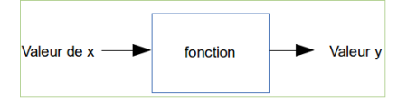
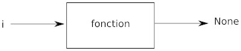

## 1) Programmer un ordinateur, c'est quoi ?

Programmer un ordinateur, c'est quoi ?
Programmer, c'est créer des programmes (suite d'instructions données à l'ordinateur) ! Un ordinateur sans programme ne sait rien faire. Il existe différents langages qui permettent de programmer un ordinateur, mais le seul directement utilisable par le processeur est le langage machine (suite de 1 et de 0). Aujourd'hui (presque) plus personne ne programme en langage machine (trop compliqué).

Les informaticiens utilisent des instructions (mots souvent en anglais) en lieu et place de la suite de 0 et de 1. Ces instructions, une fois écrites par le programmeur, sont "traduites" en langage machine. Un programme spécialisé assure cette traduction. Ce système de traduction s'appellera interpréteur ou bien compilateur, suivant la méthode utilisée pour effectuer la traduction.

Il existe 2 grandes familles de langages de programmation :

- Les langages de bas niveau sont très complexes à utiliser, car très éloignés du langage naturel, on dit que ce sont des langages « proches de la machine », en contrepartie ils permettent de faire des programmes très rapides à l'exécution. L'assembleur est le langage de bas niveau. Certains "morceaux" de programmes sont écrits en assembleur encore aujourd'hui.

- Les langages de haut niveau sont eux plus "faciles" à utiliser, car plus proches du langage naturel (exemple : si a=3 alors b=c). Exemples de langages de haut niveau : C, C++ , Java, Python...

En NSI, notre langage de prédilection sera Python.

## 2) Notion de variable

Définition du mot ordinateur d'après "Le Petit Larousse" :

"Machine automatique de traitement de l'information, obéissant à des programmes formés par des suites d'opérations arithmétiques et logiques."

Qui dit "traitement de l'information", dit donc données à manipuler. Un programme "passe" donc son temps à traiter des données. Pour pouvoir traiter ces données, l'ordinateur doit les ranger dans sa mémoire (RAM - Random Access Memory). La RAM se compose de cases dans lesquelles nous allons ranger ces données (une donnée dans une case). Chaque case a une adresse (ce qui permet au processeur de savoir où sont rangées les données).

Alors, qu'est-ce qu'une variable ?

Eh bien, c'est une petite information (une donnée) temporaire que l'on stocke dans une case de la RAM. On dit qu'elle est "variable", car c'est une valeur qui peut changer pendant le déroulement du programme.

Une variable est constituée de 2 choses :

- une valeur présente en mémoire (par exemple le nombre entier 5)

- un nom

On dira donc qu'une variable est l'association d'un nom et d'une valeur

```python
i = 12
```
Grâce à cette ligne, nous avons défini une variable qui porte le nom i. Ce nom i est associé à la valeur 12.

Il est aussi possible d'associer un nom à un nombre à virgule  :

```python
i = 5.2
```
J'attire votre  attention que nous utilisons un point à la place d'une virgule (convention anglo-saxonne).

Un nom peut donc être associé à plusieurs types d'entités (pour l'instant nous n'en avons vu que deux, mais nous en verrons d'autres plus loin) : les nombres entiers ("integer" en anglais, abrégé en "int") et les nombres à virgule ("float" en anglais). Il est possible de connaitre le type de l'entité à l'aide de l'instruction "type".

```python
a = 5
b = 5.4
```
un *type(a)* donnera comme résultat *int* alors qu'un *type(b)* donnera *float*

## 3) un peu de calculs

Un ordinateur est bien évidemment capable d'effectuer des opérations mathématiques (arithmétiques).

Les signes utilisés sont classiques : +, - , * (multiplication), / (division), // (division euclidienne) ou encore % (modulo : reste d'une division euclidienne).

Il est tout à fait possible d'effectuer des opérations directement avec des nombres, mais il est aussi possible d'utiliser des variables.

```python
a = 5
b = 16
c = 3.14 / 2
d = b / a
e = b // a
f = b % a
g = a + b
h = a
```

Considérons maintenant le programme suivant :

```python
a = 11
a = a + 1
```
D'après  vous, quelle est la valeur de la variable *a* après l'exécution du programme ci-dessus ?

La réponse est 12.

Détaillons ce qui se passe dans ce programme :

Nous créons une variable : le nom a est associé à l'entier 11. La suite est un peu plus complexe, mais très importante à comprendre. Il va falloir lire la ligne a = a + 1 de droite à gauche, décortiquons cette ligne :

- a + 1 : nous prenons la valeur actuelle associée au nom a (c'est-à-dire 11) et nous ajoutons 1 à 11, à droite de l'égalité nous avons donc maintenant la valeur 12
- nous associons la valeur qui vient d'être calculée au nom a

Donc la valeur de a est bien 12

Ce raisonnement peut être généralisé pour éviter des erreurs parfois difficiles à corriger : dans une égalité, commencer toujours par évaluer l'expression se trouvant à droite du signe égal.

L'opération 
```python
a = a + 1
```
se nomme une incrémentation.

## 4)  chaînes de caractères

### a) notion de chaîne de caractères


On peut aussi associer des noms à des suites de caractères que l'on appelle "chaîne de caractères".

```python
ma_chaine = "Bonjour le monde !"
```

Le contenu de la variable *ma_chaine* est de type *string* et donc un *type(ma_chaine)* donnera un *str* (abréviation de string en Python)


### b)  le signe + et les chaînes de caractères

L'utilisation du signe + ne se limite pas à l'addition. Il est aussi utilisé pour la concaténation.

D'après Wikipédia :

« Le terme concaténation (substantif féminin), du latin cum («avec») et catena(«chaîne, liaison»), désigne l'action de mettre bout à bout au moins deux chaînes. »

Si on considère le programme suivant :

```python
a = "Hello"
b = "World"
mon_expression = a + b
```
après l'exécution de ce programme, la variable *mon_expression* aura pour valeur  *HelloWorld*

Il est aussi possible de concaténer une chaîne de caractères et une ou plusieurs variables :

```python
ma_chaine_1 = "Bonjour "
ma_chaine_2 = "le "
res = ma_chaine_1 + ma_chaine_2 + "monde!"
```
Après l'exécution de ce programme, la variable  *res*  aura pour valeur *Bonjour le  monde!*

Les 2 noms ma_chaine_1 et ma_chaine_2 sont associés à 2 chaînes de caractères, nous avons donc bien ici une concaténation.

Que se passe-t-il si nous avons ce cas de figure :

```python
a = "Nombre de pommes : "
b = 4 
c = a + b
```
a est de type *str* alors que b est de type *int*. Le signe plus représente une addition ou une concaténation ? Ni l'un, ni l'autre, puisque Python vous renverra une erreur : il ne peut pas concaténer un entier et une chaîne de caractère.

La solution : transformer le nombre 4 en caractère 4 à l'aide du mot clé *str*:

```python
a = "Nombre de pommes : "
b = 4 
c = a + str(b)
```
nous avons maintenant une concaténation, car *str(4)* est de type string.

Autre solution pour faire cohabiter des variables de type *int* ou *float* avec des variables de type *str* : les *fstring* (attention les *fstring* sont uniquement disponible à partir de Python 3.5)

Il est possible d'écrire :

```python
a = "Nombre de pommes :"
b = 4 
c = f"{a} {b}"
```
après l'exécution du programme ci-dessus, la variable *c* aura pour valeur "Nombre de pommes : 4"

Dans la chaîne de caractère, *{a}* sera remplacé par la valeur de la variable *a*, c'est à dire *Nombre de pommes :*. Même chose avec *{b}* qui sera remplacé par la valeur de b, c'est à dire 4.

autre exemple d'utilisation des fstring :

```python
num_train = 4232
dest = "Paris" 
c = f"Le train n°{num_train} à destination de {dest} entre en gare" 
```

après l'exécution du programme ci-dessus, la variable *c* aura pour valeur "Le train n°4232 à destination de Paris entre en gare"

Notez la présence du "f" juste avant le guillemet et des accolades qui encadrent le nom de la variable. Il est nécessaire d'ajouter ce "f" pour avoir une fstring.

## 5) les  fonctions

### a) notion de fonction

Les fonctions permettent de décomposer un programme complexe en une série de sous-programmes plus simples. De plus, les fonctions sont réutilisables : si nous disposons d'une fonction capable de calculer une racine carrée, par exemple, nous pouvons l'utiliser un peu partout dans notre programme sans avoir à la réécrire à chaque fois (on parle de factorisation du code)

La notion de fonction en informatique est comparable à la notion de fonction en mathématiques.



Si nous avons y = 3x+2, pour une valeur donnée de x, nous aurons une valeur de y.

Exemple : x=4 donc y= 14 (y = 3.4+2=14, attention ici le point correspond au signe "multiplié").

La fonction en informatique est basée sur la même idée :


Voici la syntaxe employée en Python pour définir une fonction :

```
def nom_de_la_fonction(parametre):
	instruction_1
	instruction_2
	return y
suite programme
```

La fonction renvoie la valeur associée à y.

ATTENTION : Notez bien la présence du décalage entre la première ligne et les lignes suivantes. Ce décalage est appelé indentation, l'indentation permet de définir un bloc de code. Dans l'exemple ci-dessus, l'indentation nous permet de savoir que "instruction_1", "instruction_2" et "return y" constituent un bloc de code, ce bloc correspond au contenu de la fonction. "suite programme" ne fait pas partie de la fonction, car il n'est pas indenté. Pour indenter du code, il y a 2 solutions : mettre 4 espaces ou utiliser une tabulation. En Python il est conseillé d'utiliser les 4 espaces, mais ce n'est pas une obligation. Une chose est sûre, une fois que vous avez choisi une méthode, n'en changé surtout pas au cours d'un même programme !

Codons notre exemple (y=3x+2) en créant une fonction ma_fonction :

```python
def ma_fonction(x):
	y = 3 * x + 2
	return y
```
Pour "utiliser" la fonction ma_fonction, il suffit d'écrire : ma_fonction (4) (dans ce cas précis, notre fonction renverra le nombre 14 : x sera égale à 4 dans la fonction on aura donc le calcul 3 . 4 + 2 = 12  + 2 = 14)


Si on considère cet exemple  :

```python
def ma_fonction(x):
	y = 3 * x + 2
	return y
solution = ma_fonction(4)
```

Après l'exécution de ce programme, la valeur de la variable *solution* sera 14. En effet, au moment de l'exécution de notre programme le code *ma_fonction(4)* sera systématiquement remplacé par la valeur renvoyée par la fonction. Dans notre exemple le *ma_fonction(4)* sera remplacé par le nombre 14, d'où la  valeur 14 pour la variable *solution*.

Il est possible de passer plusieurs paramètres à une fonction :

```python
def ma_fonction(x, b):
	y = 2 * x + b
	return y
solution = ma_fonction(4, 3)
```
Dans  ce cas,  dans  la fonction, le paramètre *x* sera égal à 4 et le paramètre *b* à 3 (attention à l'ordre des paramètres). On a aura donc la variable *solution* qui aura pour valeur  11 (2.4 + 3 = 11) après l'exécution de ce programme.

Les paramètres peuvent être des chaînes de caractères (ainsi que la valeur retournée)

```python
def dit_bonjour(nom, age):
	phrase = f"Bonjour {nom}, vous avez {age} ans."
	return phrase
p = dit_bonjour("toto", 16) 
```
Après l'exécution de ce programme, la variable p aura  pour valeur la chaîne de caractères "Bonjour toto, vous avez 16 ans"

**Attention** : remarquez bien les guillemets autour du paramètre "toto" (c'est une chaîne de caractères)

### b) les fonctions natives de python

Python propose des fonction prêtes à être utilisées par le programmeur : les fonctions natives (built-in function en anglais). Nous avons déjà eu l'occasion d'en voir deux avec *type* (qui renvoie le type d'une variable) et *str* qui renvoie la chaîne de caractère obtenue à partir d'un nombre (*str(4)* renvoie le caractère 4). Il existe beaucoup d'autres fonctions natives Python (il en existe plus de 50). Dans l'immédiat, nous allons en étudier deux autres :

- la fonction *len* prend en paramètre une chaîne de caractères et renvoie le nombre de caractères présents dans cette chaîne de caractères (par exemple *len("azerty")* renvoie 5)

- la fonction *print* permet d'afficher à l'écran la valeur qui lui est passée en paramètre.

### c) les modules en Python

Il est possible d'utiliser d'autres fonctions "prêtes à l'emploi" en important des modules. Un module est un fichier contenant des fonctions qui pourront être utilisées dans d'autres programmes. Le module *math* est un module très important puisqu'il comporte toutes les fonctions mathématiques classiques : cosinus, sinus, exposant, racine carrée...

Pour utiliser les fonctions présentes dans un module, il est nécessaire d'importer le module dans notre programme. Par exemple, pour pouvoir utiliser les fonctions du module *math* il faudra écrire :

```python
import math
```
au début de son programme.

Pour utiliser une fonction d'un module importé, il faudra préciser le nom du module qui propose cette fonction. Par exemple, pour déterminer le sinus de 3.14, il faudra écrire :
```python
math.sin(3.14)
```    
Voici une série de calculs qui fait appel à des fonctions issues du module maths :

```python
import math

a = 5
b = 16
c = 3.14
puis = math.pow(a,3)
racine = math.sqrt(b)
s = math.sin(c)
```
Après l'exécution de ce programme :

- la variable *puis* aura pour valeur 5<sup>3</sup> = 125
- la variable *racine* aura pour valeur 4 (racine carrée de 16)
- la variable *s* aura pour valeur 0.05 (le sinus de 3.14 est 0.05)

### d) les fonctions et le mot clé return

Il est possible d'écrire une fonction sans utiliser le mot clé *return*, cette pratique est souvent considérée comme une "mauvaise pratique", mais Python ne renverra pas d'erreur si vous le faites. Le code suivant est tout à fait correct :

```python
def ma_fonction(i):
	d = 5
	z = i + d
```

Pour information, même en l'absence de *return*, une fonction Python renvoie quand même "quelque chose", puisqu'elle renvoie *None* qui veut dire rien...
Dans le cas ci-dessus nous aurons donc :



## 7) Variables locales et variables globales

### a) variables et fonctions

Considérons le programme suivant:

```python
def ma_fonc():
	i = 5
ma_fonc()
print (i)
```
Nous commençons par définir une fonction *ma_fonc* qui ne prend aucun paramètre et qui ne renvoie aucune valeur (absence du mot clé *return*). Cette fonction attribue juste la valeur 5 a la variable ayant pour nom *i*.

A la 3e ligne du programme, nous exécutons la fonction *ma_fonc*. 

Rappelons que la fonction *print* permet d'afficher à l'écran la valeur qui lui est passée en paramètre. La 4e ligne de ce programme permet donc d'afficher la valeur de la variable *i* à l'écran.

On pourrait penser que ce programme va donc afficher 5 ! Pas du tout, nous avons le droit à l'erreur suivante :

```
NameError: name 'i' is not defined
```

Le message d'erreur est suffisamment parlant, inutile de s'attarder dessus : la variable i n'est pas définie. A noter que cette erreur est déclenchée par la 4e ligne (le *print*).

Pourquoi cette erreur, la variable i est bien définie dans la fonction *ma_fonc* et la fonction *ma_fonc* est bien exécutée, où est donc le problème ?

En fait, la variable i est une variable dite locale : elle a été définie dans une fonction et elle "restera" dans cette fonction. Une fois que l'exécution de la fonction sera terminée, la variable i sera "détruite" (supprimée de la mémoire). Elle n'est donc pas accessible depuis "l'extérieur" de la fonction (ce qui explique le message d'erreur que nous obtenons, car le *print* est en dehors la fonction *ma_fonc*, la variable *i* n'est donc plus accessible).

Étudions maintenant un cas un peu plus complexe :

```python
i = 3
def ma_fonc():
	i = 5
ma_fonc()
print (i)  
```
On pourrait s'attendre à voir s'afficher la valeur 5 à l'écran. Pas du tout, nous ne rencontrons pas d'erreur cette fois, mais c'est la valeur 3 qui s'affiche à l'écran.

En fait dans cet exemple nous avons 2 variables i différentes : la variable i "globale" (celle qui a été définie en dehors de toute fonction) et la variable i "locale" (celle qui a été définie dans la fonction). Ces 2 variables portent le même nom, mais sont différentes (elles correspondent à des cases mémoire différentes). Au moment de l'exécution du *print* à la 5e ligne seule la variable globale existe encore (celle définie à la première ligne du programme), d'où l'affichage du 3.

Une variable globale peut être "utilisée" à l'intérieur d'une fonction :

```python
i = 3
def ma_fonc():
	print (i)
ma_fonc()
```
Attention, le *print* se situe dans la fonction (la ligne du *print* est bien indentée)

Ce programme permet d'afficher la valeur 3 à l'écran.

Quand on cherche à utiliser une variable dans une fonction, le système va d'abord chercher si cette variable se "trouve" dans l'espace local de la fonction, puis, s'il ne la trouve pas dans cet espace local, le système va aller rechercher la variable dans l'espace global. Pour le *print(i)* situé dans la fonction le système ne trouve pas de variable i dans l'espace local de la fonction *ma_fonc*, il passe donc à l'espace global et trouve la variable i (nous avons donc 3 qui s'affiche). 

Il est important de bien comprendre que dans la programme ci-dessous le système trouve une variable i dans l'espace local de la fonction, la "recherche" de la variable i se serait arrêtée là :

```python
i = 3
def ma_fonc():
	i = 5
	print (i)
ma_fonc()
```
et ce programme affiche la valeur 5 à l'écran. *i* a été trouvée dans l'espace local de la fonction *ma_fonc*, la recherche ne va donc pas plus loin (inutile de remonter jusqu'à l'espace global)

En revanche le programme ci-dessous génère une erreur : "UnboundLocalError: local variable 'i' referenced before assignment"

```python
i = 3
def ma_fonc():
	i = i + 1
ma_fonc()
print(i)
```

Il n'est à priori pas possible de modifier une variable globale (ici la variable *i*) dans une fonction.

Pour pouvoir modifier une variable globale dans une fonction, il faut utiliser le mot clé *global* :

```python
i = 3
def ma_fonc():
	global i
	i = i + 1
ma_fonc()
print(i)
```
Ici, aucune erreur la valeur 4 est bien affichée à l'écran.

Je ne vais pas m'étendre sur l'utilisation du mot clé *global* car comme  nous allons le voir maintenant, c'est une (très) mauvaise pratique, car cette utilisation peut entraîner des "effets de bord".

### b) les effets de bord

On parle d'effet de bord quand une fonction modifie l'état d'une variable globale. Dans notre exemple ci-dessus, la fonction *ma_fonc* modifie bien la valeur de *i* : avant l'exécution de *ma_fonc*, *i* a la valeur 3, après l'exécution de la fonction *ma_fonc*, *i* est associé à la valeur 4. Nous avons donc bien un effet de bord.

Les effets de bord c'est "mal" ! Mais pourquoi est-ce "mal" ?

Les effets de bords provoquent parfois des comportements non désirés par le programmeur (évidemment dans des programmes très complexes, pas dans des cas simplistes comme celui que nous venons de voir). Ils rendent aussi parfois les programmes difficilement lisibles (difficilement compréhensibles). À cause des effets de bord, on risque de se retrouver avec des variables qui auront des valeurs qui n'étaient pas prévues par le programmeur. On dit aussi qu'à un instant donné, l'état futur des variables est difficilement prévisible à cause des effets de bord. En résumé, on évitera autant que possible l'utilisation du "global".

Un paradigme de programmation se propose d'éviter au maximum les effets de bords : la programmation fonctionnelle. Nous étudierons ce paradigme de programmation en terminale.

## 8) les expressions et les booléens

### a) introduction

Si quelqu'un vous dit que "4 est égal à 5", vous lui répondez quoi ? "c'est faux". Si maintenant la même personne vous dit que "7 est égal à 7", vous lui répondrez bien évidemment que "c'est vrai".

En Python, ces deux "affirmations" ("4 est égal à 5" et "7 est égal à 7") s'écriront *4 == 5* et *7 == 7* (notez bien le double signe égal). 

*4 == 5* est appelé une expression, une expression est soit vraie (*True* comme *7 == 7*), soit fausse (*False* comme *4 == 5*).

Pour l'instant nous avons vu deux grands types de données : les nombres (entier ou flottant) et les chaînes de caractères, il existe un troisième type tout aussi important que les deux premiers : les booléens. Un booléen est un type de données qui ne peut prendre que deux valeurs : vrai (*True*) ou faux (*False*). Une expression est soit *True*, soit *False*.

ATTENTION : notez le double égal "==" qui permet de distinguer une expression et une affectation (association d'une valeur à un nom (variable)). Le fait de confondre le "simple égal" et le "double égal" est une erreur classique qu'il faut éviter.

Il est possible d'utiliser des variables dans une expression, par exemple avec :

```python
a = 5
b = 7
```
on aura *a == b* qui sera *False*

A la place de l'opérateur "==" il est possible d'utiliser l'opérateur "!=" qui signifie "différent de".

Par exemple *7 != 7* est *False* alors que *5 != 4* est *True*.

Notez aussi l'existence des opérateurs :

- "strictement inférieur à" <
- "strictement supérieur à" >
- "inférieur ou égal à" <=
- "supérieur ou égal à" >=

par exemple *5 < 6* est *True* alors  que *5 > 5* est *False*

### b) le "or", le "and" et le "not"

Il est aussi de combiner plusieurs expressions grâce aux opérateurs logiques *or* et *and*. Une combinaison d'expression est aussi une  expression (une combinaison d'expression est donc aussi soit *True* soit *False*)

Par exemple si nous avons 2 expressions *exp1* et *exp2* il est possible de les combiner à l'aide de l'opérateur logique *or* : *exp1 or exp2* est *False* uniquement si *exp1* et *exp2* sont *False*, elle est *True* dans tous les autres cas.

Les résultats peuvent être regroupés dans ce que l'on appelle une table de vérité :

table de vérité pour le *or*

| exp1 | exp2  | exp1  or  exp2 |
| --- | --- | --- |
| True  | True | True |
| True  | False | True |
| False  | True | True |
| False  | False | False |


table de vérité pour le *and*

| exp1 | exp2  | exp1  and  exp2 |
| --- | --- | --- |
| True  | True | True |
| True  | False | False |
| False  | True | False |
| False  | False | False |


On trouve aussi le *not* comme opérateur logique avec la table de vérité suivante :

| exp | not (exp) |
| --- | --- |
| True | False |
| False | True |

## 9) les conditions

Nous allons maintenant étudier une structure fondamentale en programmation le " si ...... alors.......sinon........".

L'idée de base est la suivante :

```
si expression:
	suite_instruction1
sinon:
	suite_instruction2
```
Si "expression" est True alors "suite_instruction1" est exécuté et "suite_instruction2" est ignoré.

Sinon (sous-entendu que "expression" est False) "suite_instruction2" est exécuté et "suite_instruction1" est ignoré.

Notez l'indentation "suite_instruction1" et de "suite_instruction2"

Si on considère le programme suivant :

```python
a = 4
b = 7
if a < b:
	print("Je suis toto.");
	print("Je n'aime pas titi.")
else:
	print("Je suis titi.")
	print("Je n'aime pas toto.")
print("En revanche, j'aime le Python.")
```
nous avons *a < b* qui est True, nous allons donc exécuter les  2 lignes 

```python
print("Je suis toto.");
print("Je n'aime pas titi.")
```
les lignes 

```python
print("Je suis titi.")
print("Je n'aime pas toto.")
```
seront ignorées.

En revanche la ligne 
```python
print("En revanche, j'aime le Python.")
```
sera systématiquement exécutée.

L'exécution de ce programme permettra d'afficher à l'écran :

```
Je suis toto.
Je n'aime pas titi.
En revanche, j'aime le Python.
```

Si maintenant on considère ce programme :

```python
a = 8
b = 7
if a < b:
	print("Je suis toto.");
	print("Je n'aime pas titi.")
else:
	print("Je suis titi.")
	print("Je n'aime pas toto.")
print("En revanche, j'aime le Python.")
```
L'exécution de ce programme entraînera l'affichage suivant  :
```
Je suis titi.
Je n'aime pas toto.
En revanche, j'aime le Python.
```

## 10) la boucle *while*

La notion de boucle est fondamentale en informatique. Une boucle permet d'exécuter plusieurs fois des instructions qui ne sont présentes qu'une seule fois dans le code.

La structure de la boucle while est la suivante :

```
while expression:
	instruction1
	instruction2
suite programme
```
Tant que *expression* sera True, on exécutera encore et encore *instruction1* et *instruction2*. Après chaque exécution de *instruction1* et *instruction2* (on dit souvent "après chaque tour de boucle"), *expression* sera de nouveau évaluée (pour savoir si elle est toujours *True* ou si elle est devenue *False*)

Quand *expression* deviendra *False* on passera directement à *suite programme* (sans entrer de nouveau dans la boucle),  la  boucle sera terminée.

Que se passe-t-il si *expression* ne devient jamais *False*  ?  On entre alors dans  une boucle "infinie" : c'est une erreur classique en programmation (aucun programme "bien fait" ne tombe dans une boucle infinie, s'il y a une boucle infinie, c'est qu'il y a forcement une erreur dans votre programme).

Considérons le programme suivant :

```python
i = 0
while i < 3  :
	print(i)
	i = i + 1
print("FIN")
```
Voici comment analyser ce programme :

Au début de l'exécution de ce programme nous avons la variable i qui a pour valeur 0. 

Nous arrivons ensuite au niveau du while :  l'expression i < 3  est True, on "entre" donc dans la boucle : on  affiche la valeur de i : 0 et on incrémente  i de 1 (i a maintenant pour valeur 1)

Nous passons au  2e tour de boucle : l'expression i < 3  est True, on "entre" donc dans la boucle : on affiche la valeur de i : 1 et on incrémente  i de 1 (i a maintenant pour valeur 2).

Nous passons au  3e tour de boucle : l'expression i < 3  est True, on "entre" donc dans la boucle : on affiche la valeur de i :  2 et on incrémente  i de 1 (i a maintenant pour valeur 3).

Nous passons au  4e tour de boucle : l'expression i < 3  est False (3 n'est pas strictement inférieur à 3), on n'entre pas dans la  boucle et on passe à l'instruction qui suit immédiatement la boucle : on exécute *print("FIN")* et le programme s'arrête (il n'y a plus d'instruction après)

Après l'exécution de ce programme, nous aurons à l'écran :

```
0
1
2
FIN
```

Il est très important que vous soyez capable d'effectuer l'analyse d'un programme comme nous venons de la faire ci-dessus, cela vous permettra d'éviter beaucoup d'erreurs

## 11) commentaires et documentation

### a) Les commentaires

Afin de rendre votre programme plus clair, il est nécessaire, dès que votre code dépasse une dizaine de lignes, d'introduire des commentaires. Bien sûr, cela peut permettre à une personne qui n'a pas écrit le programme de comprendre ce que vous avez voulu faire, mais cela peut aussi vous permettre, quelques mois après avoir terminé d'écrire votre code, de vous "rafraîchir la mémoire".

En Python, toute ligne commençant par le caractère dièse (#) sera considérée comme un commentaire par le système interpréteur/compilateur.

Voici un exemple de programme commenté :

```python
def multiplication(a,b):
	res = 0
	# on boucle a fois
	while a>0:
		#on ajoute b à res
		res = res + b
		#on décrémente a
		a = a - 1
	return res
# La variable x est égale à la valeur renvoyée par la fonction multiplication pour a = 5 et b = 3
x = multiplication(5,3)
# on affiche la valeur de x
print(x)
```

Attention, dans l'exemple ci-dessus j'ai volontairement alourdi le programme avec des commentaires inutiles vu la simplicité de ce dernier.

### b) La documentation d'une fonction

Toujours dans l'idée de rendre vos programmes plus clairs, il est important de proposer une documentation pour vos fonctions.
Cette documentation doit donner des informations sur le comportement de votre fonction, plus précisément, votre documentation doit :

- décrire votre fonction
- donner le type des paramètres de votre fonction
- donner le type de la valeur renvoyée par votre fonction


La documentation doit se trouver au tout début de votre fonction, elle commence par 3 guillemets """ et se termine aussi par 3 guillemets. Il est possible d'utiliser plusieurs lignes. Voici un exemple avec la fonction multiplication :

```python
def multiplication(a,b):
	"""Cette fonction multiplie 2 nombres a et b sans utiliser l'opérateur *
	- les paramètres sont a et b, tous les 2 de type number (int ou float)
	- la valeur renvoyée par la fonction est aussi de type number (int ou float)
	"""
	res = 0
	while a>0:
		res = res + b
		a = a - 1
	return res
```
On utilise le terme de docstring pour désigner cette façon de rediger la documentation d'une fonction (on rédige la documentation sous forme de docstring).