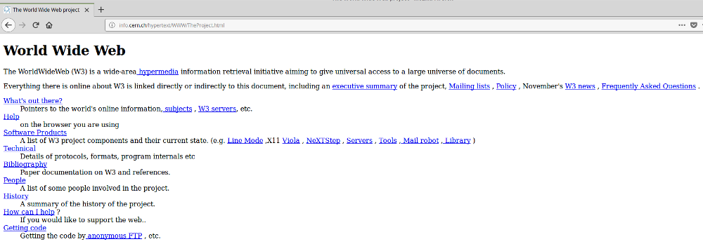

### 1) historique

Le "World Wide Web", plus communément appelé "Web" a été développé au CERN (Conseil Européen pour la Recherche Nucléaire) par le Britannique Sir Timothy John Berners-Lee et le Belge Robert Cailliau au début des années 90. À cette époque les principaux centres de recherche mondiaux étaient déjà connectés les uns aux autres, mais pour faciliter les échanges d'information Tim Berners-Lee met au point le système hypertexte. Le système hypertexte permet, à partir d'un document, de consulter d'autres documents en cliquant sur des mots clés. Ces mots "cliquables" sont appelés hyperliens et sont souvent soulignés et en bleu. Ces hyperliens sont plutôt connus aujourd'hui sous le simple terme de "liens".

Cette première page web est toujours consultable à l'adresse suivante : [http://info.cern.ch/hypertext/WWW/TheProject.html](http://info.cern.ch/hypertext/WWW/TheProject.html)

Tim Berners-Lee développe le premier navigateur web (logiciel permettant de lire des pages contenant des hypertextes), il l'appelle simplement "WorldWideWeb". Il faudra attendre 1993 et l'arrivée du navigateur web "NCSA Mosaic" pour que le web commence à devenir populaire en dehors du petit monde de la recherche.

### 2) principes de base

Techniquement le web se base sur trois choses : le protocole HTTP (HyperText Transfert Protocol), les URL (Uniform Resource Locator) et le langage de description HTML (HyperText Markup Language). Nous aurons, très prochainement l'occasion de revenir sur ces trois éléments.

### 3) confusion Web - Internet

Une chose très importante à bien avoir à l'esprit : beaucoup de personnes confondent "web" et "internet". Même si le "web" "s'appuie" sur internet, les deux choses n'ont rien à voir puisqu'"internet" est un "réseau de réseaux" s'appuyant sur le protocole IP alors que, comme nous venons de le voir, le web est la combinaison de trois technologies : HTTP, URL et HTML. D'ailleurs on trouve autre chose que le "web" sur internet, par exemple, les emails avec le protocole SMTP (Simple Mail Transfert Protocol) et les transferts de fichiers avec le protocole FTP (File Transfert Protocol).

