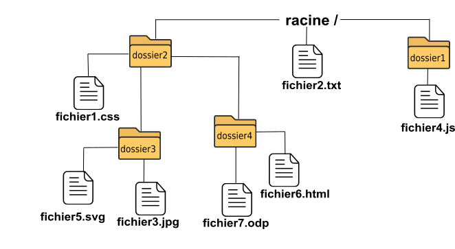

### activité 22.1

Soit la structure en arborescence suivante:

1) Donnez le chemin relatif permettant d'atteindre le fichier "fichier5.svg" depuis le dossier "dossier4".

2) Donnez le chemin absolu permettant d'atteindre le fichier "fichier6.html".