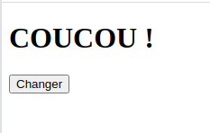

### activité 24.1

- dans votre répertoire de travail, créez un fichier *index.html*, un fichier *style.css* et un fichier *script.js*

- copiez-collez le code suivant dans le fichier *index.html* qui vient d'être créé

```html
<!doctype html>
<html lang="fr">
	<head>
		<meta charset="utf-8">
		<title>Le trio</title>
		<link rel="stylesheet" href="style.css">
	</head>
	<body>
		<h1>Le trio : HTML, CSS et JavaScript</h1>
		<p id="monPara">Voici une page web qui ne fait pas grand-chose</p>
		<button onclick="foncRouge()">Rouge</button>
		<button onclick="foncVert()">Vert</button>
	</body>
	<script src="script.js"></script>
</html>
``` 

- copiez-collez le code suivant dans le fichier *style.css* qui vient d'être créé

```css
h1{
	text-align: center;
}
.rouge {
	color:red;
	font-size:20px;
}
.vert {
	color:green;
	font-size:30px;
}
``` 

- copiez-collez le code suivant dans le fichier *script.js* qui vient d'être créé

```js
function foncRouge() {
	let balp= document.querySelector("#monPara")
	balp.classList.remove("vert");
	balp.classList.add("rouge");
}
function foncVert() {
	let balp= document.querySelector("#monPara")
	balp.classList.remove("rouge");
	balp.classList.add("vert");
}
``` 

Après avoir testé l'exemple ci-dessus en cliquant sur fichier *index.html*, apportez les modifications nécessaires pour que les  boutons *rouge* et *vert* permettent de modifier la couleur du  titre *h1*

### activité 24.2

Créez la page web suivante :



si l'utilisateur clique sur le bouton *Changer*, le texte *COUCOU !* devient rouge, si on appuie de nouveau sur le bouton *Changer*, le bouton redevient noir (si on appuie de nouveau sur le bouton, COUCOU ! redevient rouge...)

### activité 24.3

Soit la page HTML suivante :

index.html

```html
<!doctype html>
<html lang="fr">
	<head>
		<meta charset="utf-8">
		<title>Le trio</title>
		<link rel="stylesheet" href="style.css">
	</head>
	<body>
		<div></div>
	</body>
	<script src="script.js"></script>
</html>
```

style.css

```css
div {
	width : 200px;
	height : 100px;
	background-color : black;	
}
```

Modifiez le code ci-dessus pour que le survole de la *div* avec le curseur de la souris modifie la couleur de fond de la div (*background-color*)