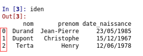

### activité 29.1

Pour nos premiers pas avec Pandas, nous allons utiliser des données très simples au format CSV, ces données sont contenues dans le fichier [ident_virgule.csv](asset/ident_virgule.csv).

- créez un répertoire *nsi_pandas* dans votre répertoire de travail

- téléchargez le fichier [ident_virgule.csv](asset/ident_virgule.csv) et placez-le dans le dossier *nsi_pandas*

- créez un fichier *nsi_p.py* et placez-le dans le dossier *nsi_pandas*

- ouvrez le fichier *nsi_p.py* avec Spyder et saisissez le code suivant dans la partie  "Éditeur" de Spyder :

```
import pandas
iden=pandas.read_csv("ident_virgule.csv")
```

Après l'exécution de ce programme, vous devriez voir apparaitre les données contenues dans la variable "iden", rangées sous la forme d'un tableau, un peu comme ce que nous obtenions en ouvrant le fichier "ident_virgule.csv" avec un tableur :


Vous avez peut-être remarqué qu'une colonne a été ajoutée par rapport à ce que nous obtenions avec le tableur :



Les nombres présents dans cette colonne sont appelés des index. Chaque ligne du tableau a un index (première ligne : index 0, deuxième ligne index 1...)

ATTENTION : les index commencent à 0 et pas à 1

Les colonnes possèdes également des index, dans notre exemple ces index correspondent au "nom" (index de la première colonne), au "prenom" (index de la deuxième colonne) et à "date_naissance" (index de la troisième colonne)

En résumé : les lignes possèdent des index (0,1,2..), les colonnes possèdent aussi des index ("nom", "prenom",...)

### activité 29.2

Il est possible de récupérer certaines données du tableau, par exemple, certaines lignes, certaines colonnes ou bien encore des valeurs uniques. Pour cela, il suffit d'utiliser l'instruction "loc" avec les index des lignes et les index des colonnes. Le principe de fonctionnement de "loc" est relativement simple puisque l'on aura une instruction de la forme *loc[index_ligne,index_colonne]*

Testez le programme suivant (vous pouvez réutiliser le fichier *nsi_p.py*) :

```
import pandas
iden=pandas.read_csv("ident_virgule.csv")
info=iden.loc[1,'prenom']
```
Vérifiez que la variable "info" contient bien le prénom "christophe"

### activité 29.3

Modifiez le programme de l'activité 29.2 pour que la valeur de la variable *info* soit égale à "12/06/1978"

### activité 29.4

Il est possible de récupérer toutes les lignes d'une colonne, il suffit de remplacer la partie "index_ligne" de "loc" par ":"

Testez le programme suivant :

```
import pandas
iden=pandas.read_csv("ident_virgule.csv")
info=iden.loc[:,'nom']
```

Vérifiez que la valeur de la variable "info" est égale à une structure de données qui contient toutes les données de la colonne d'index "nom", autrement dit, tous les noms.

### activité 29.5

Il est possible de récupérer toutes les colonnes d'une ligne particulière, cette fois en remplaçant la partie "index_colonne" de "loc" par ":"

Testez le programme suivant :

```
import pandas
iden=pandas.read_csv("ident_virgule.csv")
info=iden.loc[2,:]
```

Vérifiez que la valeur de la variable "info" est égale à une structure de données qui contient toutes les données présentes dans la ligne d'index 2 (la dernière ligne).

### activité 29.6

Il est aussi possible de récupérer seulement certaines lignes et certaines colonnes.

Testez le programme suivant :

```
import pandas
iden=pandas.read_csv("ident_virgule.csv")
info=iden.loc[[0,1],['nom','date_naissance']]
```

On récupère bien les 2 premières lignes (index 0 et index 1) et les colonnes *nom* et *date_naissance*.

Afin d'avoir des exemples plus complexes à traiter, dans la suite, nous allons travailler sur les données contenues dans le fichier [villes_virgule.csv](asset/villes_virgule.csv). Ce fichier contient des informations sur plus de 36000 communes françaises.


### activité 29.7

- téléchargez le fichier [villes_virgule.csv](asset/villes_virgule.csv) et placez-le dans répertoire *nsi_pandas*

- dans la suite vous continuerez à utiliser le ficher *nsi_p.py*


### activité 29.8

Testez le programme suivant :

```
import pandas
info_villes=pandas.read_csv("villes_virgule.csv")
``` 

Vérifiez que la variable "info_villes" contient bien les données contenues dans le fichier ville_virgule.csv.

Comme vous pouvez le constater, il manque des données dans le tableau qui s'affiche dans la console spyder (les données manquantes sont symbolisées par des ...), en effet, le tableau contient trop données pour qu'il soit entièrement affiché dans la console spyder. Heureusement, il existe une solution :

Dans spyder, dans la fenêtre située juste au-dessus de la console, vous allez trouver un onglet "Explorateur de variables". Cliquez sur cet onglet, vous devriez alors obtenir ceci :


Double-cliquez sur "info_villes" et vous devriez alors voir apparaitre une nouvelle fenêtre qui contiendra un tableau avec l'ensemble des données.

En explorant le tableau, vous devriez, notamment dans les colonnes l'altitude mini et maxi, voir apparaitre un étrange "nan" pour les dernières villes du tableau. "nan" signifie "not a number", ici, cela veut tout simplement dire que certaines données sont manquantes.

### activité 29.9

Nous allons maintenant introduire des conditions dans la sélection des villes. Imaginez par exemple que vous désirez obtenir un tableau ### activité 29.9contenant toutes les villes qui ont une altitude minimum supérieure à 1500 m :

Analysez et testez le programme suivant :

```
import pandas
info_villes=pandas.read_csv("villes_virgule.csv")
nom_alt=info_villes.loc[info_villes["alt_min"]>1500,["nom","alt_min"]]
```

Dans le "loc", l'expression "info_villes["alt_min"]>1500" est bien avant la virgule, elle concerne donc les index des lignes du tableau. On sélectionnera uniquement les lignes qui auront la valeur du descripteur "alt_min" supérieure à 1500. Nous allons donc bien sélectionner les villes qui ont une altitude minimum supérieure à 1500 m

### activité 29.10

En vous inspirant de ce qui a été fait à l'activité 29.9, écrivez un programme qui permettra d'avoir les villes qui ont une densité d'habitant inférieure à 50 (dans le tableau ainsi créé, on aura 3 colonnes : le nom de la ville, la densité de la population et l'altitude minimum)

### activité 29.11

Il est possible de combiner plusieurs facteurs de sélection en utilisant un "et"("&") ou un "ou"("|").

Analysez et testez le programme suivant :

```
import pandas
info_villes=pandas.read_csv("villes_virgule.csv")
nom_alt=info_villes.loc[(info_villes["alt_min"]>1500) & (info_villes["dens"]>50),["nom","dens","alt_min"]]
```

Vous devriez constater qu'il y a, en France, une seule ville avec une densité de population supérieure à 50 et une altitude minimum supérieure à 1500 m.

### activité 29.12

Il est aussi possible d'effectuer des calculs sur des colonnes, par exemple des moyennes. Il suffit d'utiliser l'instruction "mean" pour effectuer une moyenne :

Analysez et testez le programme suivant :

```
import pandas
info_villes=pandas.read_csv("villes_virgule.csv")
moyenne_alt_min=info_villes.loc[:,"alt_min"].mean()
```

Vous devriez constater que l'altitude minimum moyenne est de 193 m en France. Je rappelle que dans "loc[:,"alt_min"]" le ":" signifie que l'on considère toutes les lignes du tableau. De plus le "alt_min" que le calcul de la moyenne porte bien sur les données du descripteur "alt_min".

### activité 29.13

Écrivez un programme permettant de calculer le nombre moyen d'habitants en 2012

### activité 29.14

Pour l'instant nous avons calculé une moyenne sur l'ensemble des lignes, il est aussi possible d'imposer une condition sur les lignes qui seront utilisées pour le calcul.

Analysez et testez le programme suivant :

```
import pandas
info_villes=pandas.read_csv("villes_virgule.csv")
nbe_hab=info_villes.loc[info_villes["alt_min"]>1500,"nb_hab_2012"].mean()
```

Vous devriez constater que les villes ayant une altitude minimum supérieure à 1500 m avaient en moyenne 350 habitants en 2012.

### activité 29.15

Il est aussi possible de trier le tableau en fonction des valeurs d'un descripteur. Il suffit d'utiliser l'instruction "sort_values"

Analysez et testez le programme suivant :

```
import pandas
info_villes=pandas.read_csv("villes_virgule.csv")
tri_alt_min=info_villes.sort_values(by=["alt_min"])
```

Vous devriez obtenir un nouveau tableau de données "tri_alt_min" trié dans l'ordre croissant des altitudes minimums. Quelle est la ville ayant l'altitude minimum la plus faible de France ?


### activité 29.16

Il est aussi possible de trier par ordre décroissant en ajoutant "ascending=False" :

Analysez et testez le programme suivant :

```
import pandas
info_villes=pandas.read_csv("villes_virgule.csv")
tri_alt_min=info_villes.sort_values(by=["alt_min"], ascending=False)
```

Quelle est la ville ayant l'altitude minimum la plus importante de France ?

### activité 29.17

Écrivez un programme permettant de répondre à la question suivante : quelle est la ville ayant la densité de population la plus forte ?

### activité 29.18

Il est possible de fusionner 2 tableaux de données qui ont une colonne commune :

Afin de travailler sur cette fusion, nous allons travailler avec 2 fichiers au format CSV : [fiches_client.csv](asset/fiches_client.csv) et [fiches_com.csv](asset/fiches_com.csv)

Après avoir téléchargé les 2 fichiers ci-dessus, testez le code suivant :

```
import pandas
client=pandas.read_csv("fiches_client.csv")
commande=pandas.read_csv("fiches_com.csv")
```

Utilisez l'explorateur de variables de Spyder afin d'afficher le contenu des variables "client" et "commande"

Vous devriez normalement obtenir pour "client" :


et pour "commande" :


Rien de bien complexe, nous avons un tableau qui référence les clients (nom, prénom, ville), chaque client possède un numéro de client. Le deuxième tableau référence des commandes : pour chaque commande, nous avons un numéro de commande, une date et le numéro du client qui a passé la commande, ce numéro de client correspond évidemment au numéro de client que l'on trouve dans le premier tableau.

### activité 29.19

Sachant que nous avons deux colonnes contenant les mêmes types d'information (numéros de client), nous allons pouvoir fusionner les deux tableaux en un seul :

Testez le code suivant :

```
import pandas
client=pandas.read_csv("fiches_client.csv")
commande=pandas.read_csv("fiches_com.csv")
cl_com=pandas.merge(client, commande)
```

Utilisez l'explorateur de variables de Spyder afin d'afficher la valeur de la variable *cl_com*

Vous devriez obtenir ceci :


Prenons l'exemple de Mme Julie Gabriaux qui habite à Bordeaux (n° de client 2454) et de la commande effectuée le 02/02/2012 par le client ayant le n° 2454 (commande n° 45). La cliente qui a passé cette commande n° 45 est bien Mme Gabriaux, nous avons une ligne dans notre tableau *cl-com*

Nous avons bien fusionné les 2 tableaux "client" et "commande" en un seul tableau *cl_com* qui regroupe les informations pour chaque commande. Quand on effectue ce genre de fusion, on dit souvent que l'on effectue une jointure.

### activité 29.20

Il faut prendre garde à l'ordre des arguments de la fonction *merge* :

Testez le code suivant :

```
import pandas
client=pandas.read_csv("fiches_client.csv")
commande=pandas.read_csv("fiches_com.csv")
com_cl=pandas.merge(commande, client)
```

Utilisez l'explorateur de variables de Spyder afin d'afficher la valeur de la variable **com_cl*

Vous devriez obtenir ceci :


Comme vous pouvez le constater, l'ordre des colonnes est différent. Il faudra donc être attentif à l'ordre des paramètres de la fonction *merge*.

Remarque : On trouve Mme Ila Neufville sur 2 lignes, car elle a passé 2 commandes.

### activité 29.21

Vous avez peut-être remarqué que Mme Élodie Gaulin (n° de client 895) bien que présente dans le tableau "client", est absente du tableau *com_cl* (ou *cl_com*). Pourquoi d'après vous ?

### activité 29.22

De la même manière, aucun trace de la commande n° 1324 du 01/02/2017 dans le tableau *com_cl* (ou *cl_com*), pourquoi d'après vous ?


