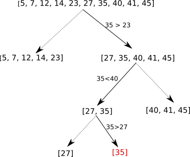
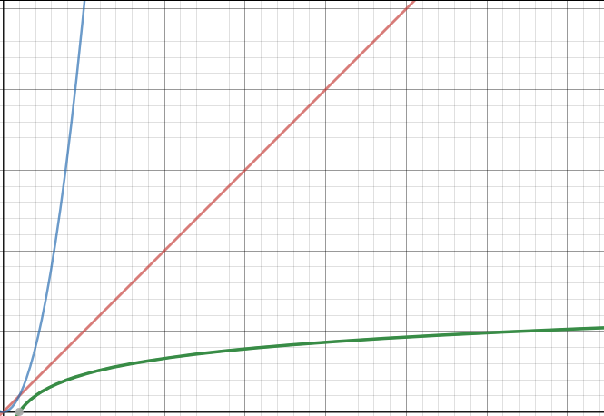

## 1) introduction

Nous avons déjà eu l'occasion d'étudier un algorithme de recherche d'un entier dans un tableau. Dans le pire des cas (l'entier recherché n'est pas dans le tableau), l'algorithme parcourt l'ensemble du tableau, nous avions donc une complexité O(n). Est-on obligé de parcourir l'ensemble du tableau pour vérifier qu'un entier x ne se trouve pas dans un tableau t ? A priori oui, sauf si le tableau t est trié !

## 2) Principe

Il est aussi possible de représenter le principe de l'algorithme de recherche dichotomique avec le schéma suivant (on recherche la valeur x=35 dans le tableau t =  [5, 7, 12, 14, 23, 27, 35, 40, 41, 45] :



Dans le schéma ci-dessus, à chaque étape, on garde uniquement le tableau désigné par la flèche en trait plein, on abandonne le tableau désigné par la flèche en pointillé. Dans la première étape on part de tableau [5, 7, 12, 14, 23, 27, 35, 40, 41, 45], ce tableau est divisé en 2 tableaux :  [5, 7, 12, 14, 23] et [27, 35, 40, 41, 45]. La valeur recherchée (35) ne peut pas être dans le premier tableau ([5, 7, 12, 14, 23]) puisque 35 > 23 et que les autres valeurs du premier tableau sont forcément plus petite que 23 (le tableau est trié). On garde donc uniquement le second tableau ([27, 35, 40, 41, 45]) et on recommence le processus (on divise ce tableau en deux...) jusqu'au moment où l'on "tombe" sur la valeur recherchée ou que l'on se retrouve avec un tableau contenant un seul élément : si l'élément unique du tableau n'est pas l'élément recherché, cela signifie que l'élément recherché n'est pas dans le tableau.

## 2) algorithme

Voici l'algorithme qui permet d'effectuer une recherche dichotomique :

```
VARIABLE
t : tableau d'entiers trié
mil : nombre entier
fin : nombre entier
deb : nombre entier
x : nombre entier // x : l'entier recherché
tr : booléen
DEBUT
tr ← FAUX
deb ← 1
fin ← longueur(t)
tant que tr == FAUX et que deb ⩽ fin :
 mil ← partie_entière((deb+fin)/2)
 si t[mil] == x :
  tr = VRAI
 sinon :
  si x > t[mil] :
   deb ← mil+1
  sinon :
   fin ← mil-1
  fin si
 fin si
fin tant que
renvoyer la valeur de tr
FIN
```

On peut résumer le principe de fonctionnement de l'algorithme de recherche dichotomique par le schéma suivant :


Les variables *deb*, *mil* et *fin* du schéma correspondent aux variables *deb*, *mil* et *fin* de l'algorithme.

### 3) complexité

Pour étudier la complexité, nous allons nous intéresser à la boucle : au niveau de la boucle, combien doit-on effectuer d'itérations pour un tableau de taille n dans le cas le plus défavorable (l'entier x n'est pas dans le tableau t) ?

Sachant qu'à chaque itération de la boucle on divise le tableau en 2, cela revient donc à se demander combien de fois faut-il diviser le tableau en 2 pour obtenir, à la fin, un tableau comportant un seul entier ? Autrement dit, combien de fois faut-il diviser n par 2 pour obtenir 1 ?

Mathématiquement cela se traduit par l'équation $\frac{n}{2^a}=1$ avec a le nombre de fois qu'il faut diviser n par 2 pour obtenir 1. Il faut donc trouver a !

A ce stade il est nécessaire d'introduire une nouvelle notion mathématique : le "logarithme base 2" noté $log_2$. Par définition $log_2(2^x)=x$

Nous avons donc :

$\frac{n}{2^a}=1$ => $n=2^a$ => $log_2(n)=log_2(2^a)=a$, nous avons donc $a=log_2(n)$
			
Nous pouvons donc dire que la complexité en temps dans le pire des cas de l'algorithme de recherche dichotomique est $O(log_2(n))$
			
Afin de pouvoir comparer l'efficacité des différents algorithmes, voici une représentation graphique des fonctions $y=x$ (en rouge), $y=x^2$ (en bleu) et $y=log_2(x)$ (en vert)



Comme vous pouvez le constater l'algorithme de recherche dichotomique est plus efficace que l'algorithme de recherche qui consiste à parcourir l'ensemble du tableau, car $x>log_2(x)$ quelque soit $x$.

Cependant, il ne faut pas perdre de vu que dans le cas de la recherche dichotomique, il est nécessaire d'avoir un tableau trié, si au départ le tableau n'est pas trié, il faut rajouter la durée du tri.
				
### 4) terminaison de l'algorithme

Pour terminer, nous allons démontrer que cet algorithme se termine dans tous les cas (on ne peut pas "tomber dans une boucle infinie") :
			
Nous avons les variables *fin* et *deb*. Définissons fin<sub>i</sub> et deb<sub>i</sub> avec i qui correspond à la ième itération de la boucle : deb<sub>0</sub> correspond à la valeur de la variable *deb* avant la première itération de la boucle (nous avons donc deb<sub>0</sub> = 0). Même chose pour fin<sub>i</sub> (nous avons donc fin<sub>0</sub> = n). À la fin de la première itération de la boucle, nous aurons fin<sub>1</sub> et deb<sub>1</sub>...
		
On définit aussi m<sub>i</sub> = (deb<sub>i</sub> + fin<sub>i</sub>) / 2.
		
Partons du principe que nous sommes à la k ième itération (i=k), nous avons plusieurs cas à considérer :
			
- si deb<sub>k</sub> > fin<sub>k</sub> ou si t[m<sub>k</sub>] = x, l'algorithme se termine, car on n'entre pas dans la boucle.
				
- si deb<sub>k</sub> ⩽ fin<sub>k</sub> et si x < t[m<sub>k</sub>], on entre dans la boucle : deb<sub>k+1</sub> = deb<sub>k</sub> et fin<sub>k+1</sub> = m<sub>k</sub> - 1. On a alors fin<sub>k+1</sub> - deb<sub>k+1</sub> < fin<sub>k</sub> - deb<sub>k</sub>
				
- si deb<sub>k</sub> ⩽ fin<sub>k</sub> et si x > t[m<sub>k</sub>], on entre dans la boucle : deb<sub>k+1</sub> = m<sub>k</sub> + 1 et fin<sub>k+1</sub> = fin<sub>k</sub>. On a alors fin<sub>k+1</sub> - deb<sub>k+1</sub> < fin<sub>k</sub> - deb<sub>k</sub>
			
Quel que soit le cas, nous avons fin<sub>k+1</sub> - deb<sub>k+1</sub> < fin<sub>k</sub> - deb<sub>k</sub>, nous pouvons donc dire que fin<sub>i</sub> - deb<sub>i</sub> est strictement décroissante.

Il existe donc un entier p tel que :
			
- soit deb<sub>p</sub> > fin<sub>p</sub>, dans ce cas l'algorithme va se terminer, car on "n'entre pas" dans la boucle et l'algorithme renvoie FAUX.
				
- soit x = t[m<sub>p</sub>] avec m<sub>p</sub> = (deb<sub>p</sub> + fin<sub>p</sub>) / 2, dans ce cas l'algorithme va se terminer, car on n'entre pas dans la boucle et l'algorithme renvoie VRAI.
	
Nous venons démontrer que l'algorithme se termine à un moment ou à un autre. Pour effectuer cette démonstration nous avons utilisé le fait que fin<sub>i</sub> - deb<sub>i</sub> est strictement décroissante. fin<sub>i</sub> - deb<sub>i</sub> est appelé un variant de boucle. 

Un variant de boucle est une grandeur qui, comme son nom l'indique, varie à chaque itération, cette variation fait qu'à un moment ou à un autre, l'algorithme finira par s'arrêter.