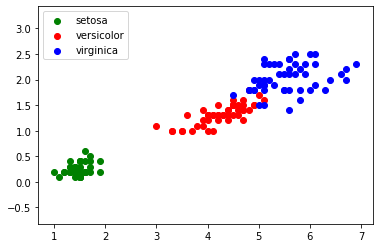
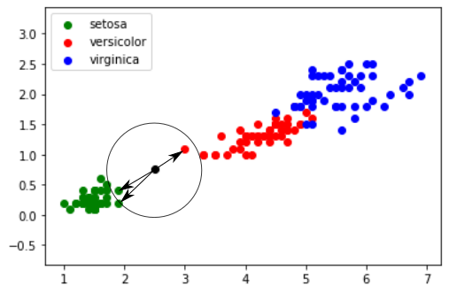

## 1)  introduction

Nous allons maintenant travailler sur un algorithme d'apprentissage automatique, souvent appelé, même en français, algorithme de machine learning. L'idée est d'utiliser un grand nombre de données afin "d'apprendre à la machine" à résoudre un certain type de problème (nous verrons un exemple un peu plus loin).

Cette idée d'apprentissage automatique ne date pas d'hier, puisque le terme de machine learning a été utilisé pour la première fois par l'informaticien américain Arthur Samuel en 1959. Pourquoi le machine learning est tant "à la mode" depuis quelques années ? Simplement parce que le nerf de la guerre dans les algorithmes de machine learning est la qualité et la quantité des données (les données qui permettront à la machine d'apprendre à résoudre un problème), or, avec le développement d'internet, il est relativement simple de trouver des données sur n'importe quel sujet (on parle de "big data"). À noter aussi l'importance des stratégies mises en place par les GAFAM (Google, Apple, Facebook, Amazon et Microsoft) afin de récupérer un grand nombre de données concernant leurs clients. Ces données sont très souvent utilisées pour "nourrir" des algorithmes de machine learning (comment, d'après vous, Amazon arrive à proposer à ces clients des "suggestions d'achats" souvent très pertinentes ?)

Nous allons étudier un algorithme d'apprentissage assez simple à appréhender : l'algorithme des "k plus proches voisins" (en anglais "k nearest neighbors" : knn)

## 2) le problème des iris

Afin de travailler sur un exemple, nous allons utiliser un jeu de données relativement connu dans le monde du machine learning : le jeu de données "iris".

En 1936, Edgar Anderson a collecté des données sur 3 espèces d'iris : "iris setosa", "iris virginica" et "iris versicolor"

iris setosa :

iris virginica : 

iris versicolor :

 
Pour chaque iris étudié, Anderson a mesuré (en cm) :

- la largeur des sépales
- la longueur des sépales
- la largeur des pétales
- la longueur des pétales

Par souci de simplification, nous nous intéresserons uniquement à la largeur et à la longueur des pétales.

Pour chaque iris mesuré, Anderson a aussi noté l'espèce ("iris setosa", "iris versicolor" ou "iris virginica")

En travaillant sur ce jeu de données, on peut obtenir le graphique suivant (en abscisse la longueur du pétale et en ordonnée la largeur du pétale) :

Nous obtenons des "nuages" de points, on remarque ces points sont regroupés par espèces d'iris (pour "iris virginica" et "iris versicolor", les points ont un peu tendance à se mélanger).

Imaginez maintenant qu'au cours d'une promenade vous trouviez un iris, n'étant pas un spécialiste, il ne vous est pas vraiment possible de déterminer l'espèce. En revanche, vous êtes capables de mesurer la longueur et la largeur des pétales de cet iris. Partons du principe qu'un pétale fasse 0,5 cm de large et 2 cm de long. Plaçons cette nouvelle donnée sur notre graphique (point en noir) :

## 3) algorithme de k plus proches voisins

Il est possible de rencontrer des cas plus difficiles, par exemple : largeur du pétale = 0,75 cm ; longueur du pétale = 2,5 cm :

Dans ce genre de cas, il peut être intéressant d'utiliser l'algorithme des "k plus proches voisins", en quoi consiste cet algorithme ?

- on calcule la distance entre notre point (largeur du pétale = 0,75 cm ; longueur du pétale = 2,5 cm) et chaque point issu du jeu de données "iris" (à chaque fois c'est un calcul de distance entre 2 points tout ce qu'il y a de plus classique)

- on sélectionne uniquement les k distances les plus petites (les k plus proches voisins)

- parmi les k plus proches voisins, on détermine quelle est l'espèce majoritaire. On associe à notre "iris mystère" cette "espèce majoritaire parmi les k plus proches voisins"

Prenons k = 3

Les 3 plus proches voisins sont signalés ci-dessus avec des flèches : nous avons deux "iris setosa" (point vert) et un "iris versicolor" (point rouge). D'après l'algorithme des "k plus proches voisins", notre "iris mystère" appartient à l'espèce "setosa".

Le choix de la valeur de k est important, il faut souvent effectuer plusieurs essais.

