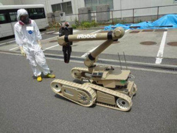
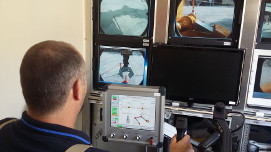

Nous allons nous intéresser aux interfaces Homme-Machine (IHM). Une IHM permet à un utilisateur d'interagir avec une machine, la souris et le clavier sont des exemples d'IHM, mais il en existe bien d'autres (par exemple les écrans tactiles des smartphones). Par "machine", on entend bien évidemment "ordinateur", comme dans le cas du duo clavier-souris, mais pas seulement. En effet, les "machines" peuvent aussi être des objets connectés, des systèmes embarqués ou encore des robots. Nous allons justement nous intéresser ici à cette dernière catégorie : les robots.

Qu'est-ce qu'un robot ?

Le mot robot a été utilisé pour la première fois par l’écrivain tchécoslovaque Karel Čapek dans sa pièce de théâtre "Rossum's Universal Robots" en 1920, il a pour origine le mot russe "rabota" qui signifie travail, corvée. La notion de robot a été ensuite développée par l'écrivain américano-russe Isaac Asimov dans son recueil de nouvelles "Les Robots" (1950).

Pour simplifier à l'extrême, un robot est constitué de 2 choses :

- des actionneurs qui lui permettent d'effectuer des actions (se déplacer, saisir des choses, faire de la soudure...)
- des capteurs qui lui permettent de "connaitre" son environnement (détecteurs d'obstacles, capteur de température...)

Au niveau IHM, il est possible d'interagir avec le robot avec une simple télécommande : l'opérateur donne des ordres au robot par l'intermédiaire de cette télécommande ("aller à gauche", "avancer de 3 mètres", "prendre un objet avec une pince"...), par exemple, les robots qui interviennent dans des milieux dangereux (centrale nucléaire) sont télécommandés à distance par des opérateurs.

robot destiné aux interventions dans les centrales nucléaires :

opérateur robot :

Il est aussi possible d'interagir avec un robot non pas directement, mais en le programmant afin de lui donner une certaine autonomie. La programmation consiste à donner au robot la marche à suivre en fonction des situations rencontrées : "si le capteur X détecte quelque chose alors arrête les moteurs".

