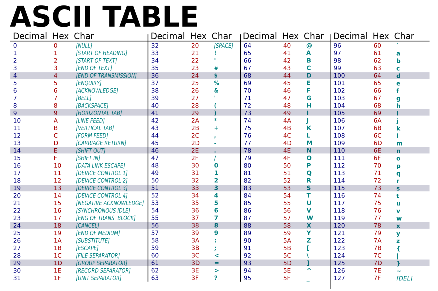

## 1) introduction

Nous savons qu'un ordinateur est uniquement capable de traiter des données binaires, comment sont donc codés les textes dans un ordinateur ? Ou plus précisément, comment sont codés les caractères dans un ordinateur ?

## 2) ASCII

Avant 1960 de nombreux systèmes de codage de caractères existaient, ils étaient souvent incompatibles entre eux. En 1960, l'organisation internationale de normalisation (ISO) décide de mettre un peu d'ordre dans ce bazar en créant la norme ASCII (American Standard Code for Information Interchange). À chaque caractère est associé un nombre binaire sur 8 bits (1 octet). En faite, seuls 7 bits sont utilisés pour coder un caractère, le 8e bit n'est pas utilisé pour le codage des caractères. Avec 7 bits il est possible de coder jusqu'à 128 caractères ce qui est largement suffisant pour un texte écrit en langue anglaise (pas d'accents et autres lettres particulières).

Comme vous pouvez le constater dans le tableau ci-dessus, au "A" majuscule correspond le code binaire 10000012 (6510 ou 4116)

Certains codes ne correspondent pas à des caractères (de 0 à 3210), nous n'aborderons pas ce sujet ici.

## 3) ISO-8859-1

La norme ASCII convient bien à la langue anglaise, mais pose des problèmes dans d'autres langues, par exemple le français. En effet l'ASCII ne prévoit pas d'encoder les lettres accentuées. C'est pour répondre à ce problème qu'est née la norme ISO-8859-1. Cette norme reprend les mêmes principes que l'ASCII, mais les nombres binaires associés à chaque caractère sont codés sur 8 bits, ce qui permet d'encoder jusqu'à 256 caractères. Cette norme va être principalement utilisée dans les pays européens puisqu'elle permet d'encoder les caractères utilisés dans les principales langues européennes (la norme ISO-8859-1 est aussi appelée "latin1" car elle permet d'encoder les caractères de l'alphabet dit "latin")

Problème, il existe beaucoup d'autres langues dans le monde qui n'utilisent pas l'alphabet dit "latin", par exemple le chinois ou le japonais ! D'autres normes ont donc dû voir le jour, par exemple la norme "GB2312" pour le chinois simplifié ou encore la norme "JIS_X_0208" pour le japonais.

Cette multiplication des normes a très rapidement posé problème. Imaginons un français qui parle le japonais. Son traitement de texte est configuré pour reconnaitre les caractères de l'alphabet "latin" (norme ISO-8859-1). Un ami japonais lui envoie un fichier texte écrit en japonais. Le français devra modifier la configuration de son traitement afin que ce dernier puisse afficher correctement l'alphabet japonais. S'il n'effectue pas ce changement de configuration, il verra s'afficher des caractères ésotériques.

## 4) Unicode

Pour éviter ce genre de problème, en 1991 une nouvelle norme a vu le jour : Unicode

Unicode a pour ambition de rassembler tous les caractères existant afin qu'une personne utilisant Unicode puisse, sans changer la configuration de son traitement de texte, à la fois lire des textes en français ou en japonais

Unicode est uniquement une table qui regroupe tous les caractères existant au monde, il ne s'occupe pas de la façon dont les caractères sont codés dans la machine. Unicode accepte plusieurs systèmes de codage : UTF-8, UTF-16, UTF-32. Le plus utilisé, notamment sur le Web, est UTF-8.

Pour encoder les caractères Unicode, UTF-8 utilise un nombre variable d'octets : les caractères "classiques" (les plus couramment utilisés) sont codés sur un octet, alors que des caractères "moins classiques" sont codés sur un nombre d'octets plus important (jusqu'à 4 octets). Un des avantages d'UTF-8 c'est qu'il est totalement compatible avec la norme ASCII : Les caractères Unicode codés avec UTF-8 ont exactement le même code que les mêmes caractères en ASCII.