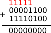

## 1) une mauvaise idée pour commencer...

Nous avons déjà vu comment représenter les entiers positifs, nous allons maintenant nous intéresser aux entiers relatifs.

La première idée qui pourrait nous venir à l'esprit est, sur un nombre comportant n bits, d'utiliser 1 bit pour représenter le signe et n-1 bit pour représenter la valeur absolue du nombre à représenter. Le bit de signe étant le bit dit "de poids fort" (c'est à dire le bit le plus à gauche), ce bit de poids fort serait à 0 dans le cas d'un nombre positif et à 1 dans le cas d'un nombre négatif.

un exemple : on représente l'entier 5 sur 8 bits par 00000101, -5 serait donc représenté par 10000101

Il existe un énorme inconvénient à cette méthode : l'existence de deux zéros, un zéro positif (00000000) et un zéro négatif (10000000) !

Ce problème est, pour plusieurs raisons qui ne seront pas développées ici, rédhibitoire. Nous allons donc devoir utiliser une autre méthode : le complément à deux

## 2) le complément à deux

Avant de représenter un entier relatif, il est nécessaire de définir le nombre de bits qui seront utilisés pour cette représentation (souvent 8, 16 , 32 ou 64 bits)

Prenons tout de suite un exemple : déterminons la représentation de -12 sur 8 bits

- Commençons par représenter 12 sur 8 bits (sachant que pour représenter 12 en binaire seuls 4 bits sont nécessaire, les 4 bits les plus à gauche seront à 0) : 00001100

- Inversons tous les bits (les bits à 1 passent à 0 et vice versa) : 11110011

- Ajoutons 1 au nombre obtenu à l'étape précédente :

les retenues sont notées en rouge

La représentation de -12 sur 8 bits est donc : 11110100

Comment peut-on être sûr que 11110100 est bien la représentation de -12 ?

Nous pouvons affirmer sans trop de risque de nous tromper que 12 + (-12) = 0, vérifions que cela est vrai pour notre représentation sur 8 bits.

Dans l'opération ci-dessus, nous avons un 1 pour le 9e bit, mais comme notre représentation se limite à 8 bits, il nous reste bien 00000000.

Il faut noter qu'il est facile de déterminer si une représentation correspond à un entier positif ou un entier négatif : si le bit de poids fort est à 1, nous avons affaire à un entier négatif, si le bit de poids fort est à 0, nous avons affaire à un entier positif.

La plus petite valeur qu'il est possible de coder sur 8 bits est 10000000 (soit -128). La plus grande valeur est 01111111 (soit 127). 

Plus généralement, nous pouvons dire que pour une représentation sur n bits, il sera possible de coder des valeurs comprises entre -2n-1 et +2n-1 - 1