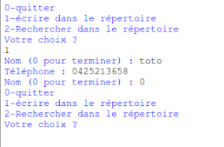
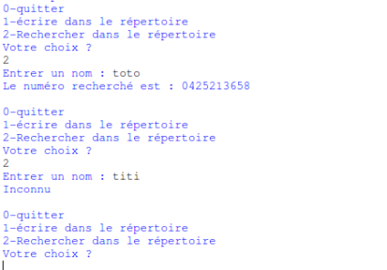

Avant d'entrer dans le vif du sujet (le projet), il est nécessaire d'étudier quelques éléments supplémentaires.

## 1) la fonction input

la fonction *input* va permettre aux utilisateurs de saisir des données au clavier.

### projet 1.1

Testez ce programme à l'aide de Spyder :

```
age=input("Quel est votre âge ? ")
```
			
Quel est là valeur de la variable *age* après avoir exécuté le programme ci-dessus (utilisez la console pour répondre à cette question) ? Quel est le type de la variable *age* ?

Comme vous avez pu le constater, la valeur saisie par l'utilisateur sera toujours de type "string".

### projet 1.2

Testez ce programme à l'aide de Spyder :

```
a=input("Entrez un nombre")
a=a+1
```

Comme vous l'avez remarqué, nous avons une erreur puisque la valeur référencée par la variable a est de type string, la ligne "a=a+1" puisque nous avons un entier avec 1 et une chaîne de caractères avec la variable a, séparés par un signe +, (le signe + correspond à une concaténation ou à une addition ?) Python n'est pas capable de gérer le problème, nous avons donc une erreur.

Pour éviter ce genre de problème, il peut être nécessaire de "transformer" notre chaîne de caractères en entier :

### projet 1.3

Testez ce programme à l'aide de Spyder :

```
a=input("Entrez un nombre")
a=int(a)
a=a+1
```

## 2) Écrire et lire dans un fichier externe

Il est possible de lire ou d'écrire des données dans un fichier extérieur.

La première des choses à faire est d'ouvrir notre fichier texte. Pour ce faire nous utiliserons la méthode open.

```
with open('nomDuFichier', 'r') as f :
```

Nous utilisons ici une structure particulière que nous n'avons encore jamais rencontrée : le "with". Ce "with" indique que nous allons utiliser un "context manager". Cette notion de "context manager" n'est pas au programme de NSI, nous n'allons donc pas l'étudier en tant que tel. Vous avez juste besoin de savoir que son utilisation permet de manipuler des fichiers externes "proprement".

La méthode *open* prend 2 paramètres : le nom du fichier et le mode d'ouverture du fichier :

Il existe 3 modes d'ouverture :

- 'r ' : ouverture en lecture

- 'w' : ouverture en écriture. Le contenu du fichier est écrasé. Si le fichier n'existe pas, il est créé.

- 'a' : ouverture en écriture en mode ajout. On écrit à la fin du fichier sans écraser l'ancien contenu du fichier. Si le fichier n'existe pas, il est créé.

Une fois le fichier ouvert, il est possible d'écrire dedans (à l'aide de *write*) ou de lire son contenu (à l'aide de *read*).

### projet 1.4

Étudiez et testez le programme suivant :

```
nom=input('Entrez un mot')
with open('fichier.txt','a') as f :
	f.write(nom)
```
		
Le répertoire courant devrait maintenant contenir aussi un fichier *fichier.txt*. Ouvrez ce fichier (avec un éditeur de texte) et vérifiez qu'il contient bien le mot entré par l'utilisateur.

### projet 1.5

Étudiez et testez le programme suivant :

```
with open('fichier.txt','r') as f :
	ligne=f.read()
```
			
Quelle va être la valeur de la variable *ligne* après l'exécution de ce programme ? Vérifiez votre réponse.

### projet 1.6

Écrivez un programme permettant à l'utilisateur de sauvegarder 5 noms dans un fichier texte (*fichier.txt*)

Vérifiez que votre programme est correct en ouvrant le fichier *fichier.txt* à l'aide d'un éditeur de texte.

Votre fichier texte devrait être illisible (les mots s'enchaînent sans aucun espace ou saut à la ligne). Il est tout à fait possible de "forcer" le saut de ligne en utilisant la suite de caractères suivante: \n (l'enchaînement des caractères \ et n entraîne un "retour chariot"). L'instruction suivante :

```
print('hello \n world')
```
n'affiche pas : 

```
hello \n world
```

mais :

```
hello
world
```

Nous avons bien un saut de ligne (un "retour chariot"). Le caractère \n n'est pas affiché.

### projet 1.7

Modifier votre programme du "1.6" afin d'avoir un nom par ligne dans le fichier texte (*fichier.txt*)

### projet 1.8

Voici un programme permettant de lire le fichier texte et de ranger les différents noms entrés par l'utilisateur dans une liste, testez ce programme :

```
noms=[]
with open('fichier.txt','r') as f :
    for ligne in f:
        ligne=ligne.replace("\n","")
        noms.append(ligne)
```

NB : la ligne *ligne=ligne.replace("\n","")* permet d'enlever la suite de caractères \n, car même si \n n'est pas visible dans le fichier texte, elle est tout de même présente.

## 3) Commenter son code

Afin de rendre votre programme plus clair, il est nécessaire, dès que votre code dépasse une dizaine de lignes, d'introduire des commentaires. Bien sûr cela peut permettre à une personne qui n'a pas écrit le programme de comprendre ce que vous avez voulu faire, mais cela peut aussi vous permettre, quelques mois après avoir terminé d'écrire votre code, de vous "rafraîchir la mémoire".

En Python, toute ligne commençant par le caractère dièse (#) sera considérée comme un commentaire par le système interpréteur/compilateur.

Voici un exemple de programme commenté :

```
# la fonction monMessage permet d'afficher un message
#****************début de la fonction monMessage******************
def monMessage(nom):
	return f"Bonjour {nom}"
#****************fin de la fonction monMessage********************
# interrogation de l'utilisateur
monNom=input("Quel est votre nom ? ")
# appel de la fonction monMessage
msg=monMessage(monNom)
```

Attention, dans l'exemple ci-dessus j'ai volontairement alourdi le programme avec des commentaires inutiles vu la simplicité de ce dernier.

## 4) projet

En utilisant les connaissances acquises jusqu'à présent, vous allez écrire un programme de gestion de répertoire téléphonique.

### projet 1.9

Ce programme devra proposer le menu suivant à l'utilisateur :

```
0-quitter
1-écrire dans le répertoire
2-rechercher dans le répertoire
Votre choix ?
```

Si le choix est 0 : Le programme sera stoppé.

Si le choix est 1 :

L'utilisateur devra saisir un nom ou 0 s'il veut terminer la saisie (" Nom (0 pour terminer) : ") :

- L'utilisateur entre 0 => le programme devra le renvoyer vers le menu

- L'utilisateur entre un nom => le programme devra lui demander de saisir le numéro de téléphone correspondant au nom. Une fois le numéro saisi, le programme devra lui proposer d'entrer un nouveau nom (ou 0 pour terminer)...

exemple de saisie d'un utilisateur (toto) :



Si le choix est 2 :

L'utilisateur devra saisir le nom recherché ("Entrer un nom :").

- Si le nom recherché est présent dans le répertoire, le programme devra afficher " Le numéro recherché est : " suivi du numéro de téléphone correspondant au nom saisi.

- Si le nom recherché est absent du répertoire, le programme devra afficher " Inconnu ".

L'utilisateur est ensuite redirigé vers le menu principal.

recherche des utilisateurs (toto et titi) :



Voici une démonstration en vidéo : [https://www.youtube.com/watch?v=itSlzuGZHe8](https://www.youtube.com/watch?v=itSlzuGZHe8)

Les noms et numéros de téléphone devront être stockés dans un fichier texte.

Votre programme devra être composé au minimum de 3 fonctions : une fonction *menu*, une fonction *lecture* et une fonction *ecriture*.

